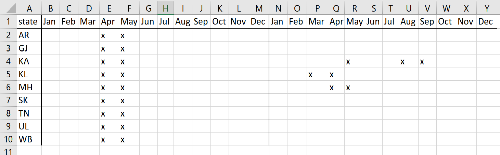

```{r setup, include=FALSE}
library(tidyverse)
library(lubridate)
library(patchwork)
library(boot)

theme_set(theme_bw())

covid_palette <- c("#1B9E77", "#E89005", "#EF4050", "#9678B6")
covid_palette3 <- c("#1B9E77", "#E89005", "#9678B6")

covid_palette2 <- c("#1B9E77", "#D95F02", "#7570B3", "#555555")

knitr::opts_chunk$set(echo = FALSE, warnings = FALSE, 
                      messages = FALSE, cache.lazy = FALSE)

```

```{r data_filt, cache=TRUE}
### importing from modified ebd RData
load("data/ebd_IN_relNov-2021.RData") 

### list of group accounts to be filtered
groupaccs <- read.csv("data/ebd_users_GA_relSep-2021.csv", 
                      na.strings = c(""," ",NA), quote = "", header = T, 
                      nrows = 401)  # excluding empty cells
groupaccs <- groupaccs %>% 
  mutate(CATEGORY = case_when(GA.1 == 1 ~ "GA.1", 
                              GA.2 == 1 ~ "GA.2", 
                              TRUE ~ "NG"))
filtGA <- groupaccs %>% filter(CATEGORY == "GA.1") %>% select(OBSERVER.ID)


### new observer data (to calculate no. of new observers metric)
new_obsr_data <- data %>% 
  select(c("YEAR", "MONTH", "STATE", "SAMPLING.EVENT.IDENTIFIER",
           "LAST.EDITED.DATE", "OBSERVER.ID")) %>% 
  mutate(LAST.EDITED.DATE = ymd_hms(LAST.EDITED.DATE)) %>% 
  group_by(OBSERVER.ID) %>% 
  arrange(LAST.EDITED.DATE) %>% 
  ungroup() %>% 
  distinct(OBSERVER.ID, .keep_all = TRUE) %>%
  mutate(LE.YEAR = year(LAST.EDITED.DATE),
         LE.MONTH = month(LAST.EDITED.DATE)) %>% 
  filter(LE.YEAR >= 2019) %>% 
  mutate(COVID = factor(case_when(LE.YEAR == 2019 ~ "BEF_19", 
                                  LE.YEAR == 2020 ~ "DUR_20",
                                  LE.YEAR == 2021 & LE.MONTH < 9 ~ "DUR_21",
                                  LE.YEAR == 2021 & LE.MONTH >= 9 ~ "AFT_21",
                                  TRUE ~ "NA"),
                        levels = c("BEF_19","DUR_20", "DUR_21", "AFT_21")))

# filtering
new_obsr_data <- new_obsr_data %>% anti_join(filtGA) 

save(new_obsr_data, file = "data/new_obsr_data.RData")


### main data
data <- data %>% filter(YEAR >= 2019) 
save(data, file = "data/rawdata.RData")

# filters
data0 <- data %>% anti_join(filtGA) %>% 
  filter(PROTOCOL.TYPE %in% c("Traveling","Stationary"))

rm(list = setdiff(ls(envir = .GlobalEnv), c("data0")), pos = ".GlobalEnv")
save.image("data/data0.RData")

# random subset for analysis + adding COVID category
set.seed(10)
data_sub <- data0 %>% 
  filter(GROUP.ID %in% sample(unique(data0$GROUP.ID),100000)) %>% 
  mutate(COVID = factor(case_when(YEAR == 2019 ~ "BEF_19", 
                                  YEAR == 2020 ~ "DUR_20",
                                  YEAR == 2021 & MONTH < 9 ~ "DUR_21",
                                  YEAR == 2021 & MONTH >= 9 ~ "AFT_21"),
                        levels = c("BEF_19","DUR_20", "DUR_21", "AFT_21")))
save(data_sub, file = "data/data_sub.RData")
```

```{r data_load, eval=FALSE, cache=TRUE, dependson="data_filt"}
load("data/data_sub.RData")
```

```{r bootSE_fun, include=FALSE}

# Useful resources: 
# https://www.middleprofessor.com/files/applied-biostatistics_bookdown/_book/variability-and-uncertainty-standard-deviations-standard-errors-confidence-intervals.html#bootstrap 
# https://websites.pmc.ucsc.edu/~mclapham/Rtips/resampling

# For some metrics like birding distance, it is possible to calculate SE from the data itself ("expected SE" = SD of sample / root sample size). But when there is a possibility to calculate the empirical SE instead (via bootstrapping) which is more accurate, there is no point in going for the former. 

boot_se = function(x, fn = mean, B = 1000) {
  1:B %>%
    # For each iteration, generate a sample of x with replacement
    map(~ x[sample(1:length(x), replace = TRUE)]) %>%
    # Obtain the fn estimate for each bootstrap sample
    map_dbl(fn) %>%
    # Obtain the standard error
    sd()
}

```


# Introduction

This study will focus on the impacts of the COVID-19 pandemic on both birds and the birding community in the Indian context. It will also try to understand the consequences of these changes on citizen science and the inferences that can be drawn from it. Lastly, it will propose guidelines for making the most of the available data while accounting for pandemic-driven biases and deviations from the pre-COVID normal. 

To ensure a balanced time frame, this study will focus on the years from 2018 to 2021. The time period of 2018–19 will be considered as “pre-COVID” while 2020–21 will be considered “COVID”. In order to account for within-year variations in bird and birder behaviour, the comparisons will be made on the month level. For instance, various metrics of birding behaviour in the month of June will be compared between 2018–19 and 2020–21, and will not be confounded with patterns seen in other months. 

## Questions

Are there any changes and gaps in the pandemic eBird data? These questions will be answered using numerous metrics calculated from the focal data point in eBird data, a checklist.

- What has happened to overall birding activity? 

- What has happened to group birding? Has it decreased, as would be expected?

- Has birding effort changed with the pandemic? 

- Are there biases in the pandemic birding activity in terms of spatial and temporal spread?


# Preliminary analyses

***This notebook is the preliminary analysis notebook for the study. Here, I explore, mainly via visualisations, the basic patterns in the data.***

Among other filters applied, the data being used is a random subset (100,000 unique lists) of the full data, in order to reduce storage and computational demands.


## COVID timeline at national and state levels

### National level

#### Waves:  

```{r nationalwaves}
nwaves <- read.csv("data/covid_19_india.csv")
nwaves <- nwaves %>% mutate(date = as.Date(date, "%d/%m/%Y")) %>% 
  group_by(date) %>% summarise(cases = sum(cases))
nwaves <- nwaves %>% mutate(tot_cases = cases, 
                            cases = cases - lag(cases, default = 0))

ggplot(nwaves, aes(date, cases)) + geom_line() +
  scale_y_continuous(labels = scales::label_comma()) +
    ggtitle("New COVID cases (as of Aug 2021)") +
  xlab("Date") + ylab("Cases") +
  theme(axis.text.y = element_text(angle = 90),
        axis.title.y = element_text(vjust = 3))

```

While there is no strict definition for a "wave" or "phase" of an epidemic [@wagnerWhatMakesWave], here we use the general connotation of a natural pattern of sharply defined peaks and valleys in the number of sick/infected individuals. As such, India has experienced two waves at the national level [see @worldhealthorganizationIndiaWHOCoronavirus].  

1. July 2020--December 2021  
2. March 2021--June 2021

#### Lockdowns:  

```{r nationallocks}

```

1. 24 March 2020--31 May 2020 [@CoronavirusIndiaEnters2020; @gettlemanModiOrders3Week2020; @banerjeaCoronavirusLockdownExtended2020; @LockdownGuidelinesNationwide2020]  
2. Second phase: The second wave of the pandemic in India has seen no nationwide lockdown [@Covid19SecondWave2021; @sangalAnalysisAnotherNational2021].

#### Vaccination drives:  

1. March 2021--June 2021  
2. July 2021--mid-Aug 2021 (end of data)

```{r vax}
vax <- read.csv("data/covid_vaccine_statewise.csv", as.is=F)
vax <- mutate(vax, date = as.Date(date, "%d/%m/%Y"))
ggplot(filter(vax, state == "India"), aes(date, dose2)) + geom_line() +
  scale_y_continuous(labels = scales::label_comma()) +
  ggtitle("Second vaccine doses administered (as of Aug 2021)") +
  xlab("Date") + ylab("Doses") +
  theme(axis.text.y = element_text(angle = 90),
        axis.title.y = element_text(vjust = 3))
```


The lower plateau of the second dose vaccinations is certainly post mid-August, so we will use data from September onwards as control, to compare with DURING. 

### State level


```{r states}
states <- read.csv("data/covid_19_india.csv")
states <- states %>% mutate(date = as.Date(date, "%d/%m/%Y"))
states <- states %>% group_by(state) %>% 
  mutate(tot_cases = cases, 
         cases = cases - lag(cases, default = 0))
```


#### Kerala

```{r states_KL}
ggplot(filter(states, state == "Kerala"), aes(date, cases)) + geom_line()
```

##### Waves:  
1. September 2020--November 2020
2. January 2021--March 2021  
3. April 2021--June 2021
4. August 2021--August 2021 (end of data)

##### Lockdowns:  
1. 24 March 2020--31 May 2020
2. March 2021--April 2021  
[@GoKDashboardOfficial]

#### Karnataka

```{r states_KA}
ggplot(filter(states, state == "Karnataka"), aes(date, cases)) + geom_line()
```

##### Waves:  
1. July 2020--November 2020  
2. April 2021--June 2021

##### Lockdowns:  
1. 24 March 2020--31 May 2020
2. May 2021--May 2021 [@Covid19SecondWave2021]  
3. August 2021--September 2021 (some districts) [@KarnatakaImposesWeekend2021]

#### Tamil Nadu

```{r states_TN}
ggplot(filter(states, state == "Tamil Nadu"), aes(date, cases)) + geom_line()
```

##### Waves:  
1. June 2020--November 2020  
2. April 2021--July 2021

##### Lockdowns:  
1. 24 March 2020--31 May 2020

#### Maharashtra

```{r states_MH}
ggplot(filter(states, state == "Maharashtra"), aes(date, cases)) + geom_line()
```

##### Waves:  
1. July 2020--November 2020  
2. March 2021--June 2021

##### Lockdowns:  
1. 24 March 2020--31 May 2020
2. April 2021--May 2021 [@Covid19SecondWave2021]  

#### Gujarat

```{r states_GJ}
ggplot(filter(states, state == "Gujarat"), aes(date, cases)) + geom_line()
```

##### Waves:  
1. April 2021--June 2021  

##### Lockdowns:  
1. 24 March 2020--31 May 2020  
2. April 2021--June 2021 (only night curfew + other restrictions) [@LockdownGujaratNight2021; @GujaratCOVID19Restrictions2021]
No state lockdowns. Only curfews and other restrictions. [@Covid19SecondWave2021]

#### Maharashtra

```{r states_AR}
ggplot(filter(states, state == "Maharashtra"), aes(date, cases)) + geom_line()
```

##### Waves:  
1. August 2020--December 2020   
2. May 2021--August 2021 (end of data)

##### Lockdowns:  
1. 24 March 2020--31 May 2020
2. 

#### West Bengal

```{r states_WB}
ggplot(filter(states, state == "West Bengal"), aes(date, cases)) + geom_line()
```

##### Waves:  
1. July 2020--January 2021  
2. April 2021--July 2021

##### Lockdowns:  
1. 24 March 2020--31 May 2020
2. 

#### Sikkim

```{r states_SI}
ggplot(filter(states, state == "Sikkim"), aes(date, cases)) + geom_line()
```

##### Waves:  
1. April 2021--June 2021  
2. July 2021--August 2021 (end of data)

##### Lockdowns:  
1. 24 March 2020--31 May 2020
2. 

#### Uttarakhand

```{r states_UK}
ggplot(filter(states, state == "Uttarakhand"), aes(date, cases)) + geom_line()
```

##### Waves:  
1. August 2020--November 2020  
2. December 2020--January 2021
3. April 2021--June 2021

##### Lockdowns:  
1. 24 March 2020--31 May 2020
2. 


## Birder behaviour (focus level: checklists)

Changes in eBirder behaviour will be analysed using the focal data point, checklists. A number of metrics based on checklists will be calculated and analysed (**at the monthly scale**), such as:

1. Number of submitted checklists  
1.1. Total lists  
1.1. Shared lists (use no. of obs.)  
1. Number of submitted checklists per observer  
1.1. Total lists  
1.1. Shared lists (use no. of obs.)  
1. Hotspot birding  
1. Birding protocol  
1. Birding distance
1. Site fidelity per observer  
1. Habitats surveyed  
1. Spatial spread of birding activity. These spatial patterns will be explored at two scales too: nationwide and regional.  
1.1. Spatial spread by absences  
1.1. Spatial spread by densities  
1. List duration
1. List length  
1. Birding time per observer (monthly for prelim, later maybe daily)  
1. Temporal spread of birding activity  
1.1. Temporal spread within day (time-of-day)  
1.1. Temporal spread within week (day-of-week)  
1. Media  
1. Number of new birders

When running the actual models, observer will be used as a random effect because all of these metrics would vary differently from observer to observer.

Aside from comparing trends before and during the pandemic, at a finer scale we will also try to find patterns matching the various waves of spread and complete lockdown, as well as the vaccination progress.

Post-presentation: regarding averaging national level patterns by state for some metrics, this means that means are manually calculated for states and the points plotted in the graph are only these single points per state (instead of all the raw data points).


### Group birding 

Doesn't include duplicate lists as we are interested in Boolean group/solo, and otherwise proportion will be inflated just by having more birders in the group birding session.

```{r no_lists, cache=TRUE, message=FALSE}

# only considers unique lists

# since we need to look at each month separately and since this is not per observer, there is no source of variation in the counts (no. of lists).
# hence, stick to proportion CIs

temp1 <- data_sub %>% 
  group_by(GROUP.ID) %>% 
  slice(1) %>% ungroup() %>% 
  group_by(COVID, YEAR, MONTH, STATE) %>% 
  summarise(NO.LISTS = n_distinct(GROUP.ID)) %>%
  ungroup() 

temp2 <- data_sub %>% 
  group_by(GROUP.ID) %>% 
  slice(1) %>% ungroup() %>% 
  filter(NUMBER.OBSERVERS > 1) %>% 
  group_by(COVID, MONTH, STATE) %>% 
  summarise(NO.SLISTS = n_distinct(GROUP.ID)) %>%
  ungroup() %>% 
  complete(COVID, MONTH, STATE, fill = list(NO.SLISTS = 0))

# unequal values for lower and upper: bracketing the CI(?)
# https://en.wikipedia.org/wiki/Binomial_proportion_confidence_interval#Bracketing_the_confidence_interval
# cannot use this because here we need to propagate. hence, assume Gaussian.
#
# SE of proportions = sqrt((p)(1-p)/n)
# z = 1.96 for 95% CI


nl_sw <- temp1 %>% 
  left_join(temp2) %>% 
  mutate(PROP.SLISTS = NO.SLISTS/NO.LISTS,
         PROP.SE = sqrt((PROP.SLISTS)*(1 - PROP.SLISTS)/NO.LISTS),
         PROP.CI.L = PROP.SLISTS - 1.96*PROP.SE,
         PROP.CI.U = PROP.SLISTS + 1.96*PROP.SE)

rm(list = c("temp1","temp2"))

nl_nw <- nl_sw %>% ungroup() %>% 
  group_by(COVID, YEAR, MONTH) %>% 
  summarise(PROP.SLISTS = mean(PROP.SLISTS),
            PROP.SE = sqrt(sum((PROP.SE)^2))/n(),
            PROP.CI.L = PROP.SLISTS - 1.96*PROP.SE,
            PROP.CI.U = PROP.SLISTS + 1.96*PROP.SE)


(ggplot(nl_nw, aes(MONTH, PROP.SLISTS, colour = COVID)) + 
  scale_x_continuous(breaks = 1:12) + 
  geom_point(size = 3, position = position_dodge(0.5)) +
  geom_errorbar(aes(ymin = PROP.CI.L, ymax = PROP.CI.U), 
                size = 1.25, width = 0.4, position = position_dodge(0.5)) +
  scale_colour_manual(values = covid_palette) +
  labs(title = "Change in monthly group birding with pandemic at national level",
       x = "Month", y = "Proportion of group birding lists")) /
((ggplot(filter(nl_sw, STATE == "Kerala"), 
       aes(MONTH, PROP.SLISTS, colour = COVID)) + 
  scale_x_continuous(breaks = 1:12) + 
  geom_point(size = 3, position = position_dodge(0.5)) +
  geom_errorbar(aes(ymin = PROP.CI.L, ymax = PROP.CI.U), 
                size = 1.25, width = 0.4, position = position_dodge(0.5)) +
  scale_colour_manual(values = covid_palette) +
  labs(title = "Kerala",
       x = "Month", y = "Proportion of group birding lists")) |
(ggplot(filter(nl_sw, STATE == "Karnataka"), 
       aes(MONTH, PROP.SLISTS, colour = COVID)) + 
  scale_x_continuous(breaks = 1:12) + 
  geom_point(size = 3, position = position_dodge(0.5)) +
  geom_errorbar(aes(ymin = PROP.CI.L, ymax = PROP.CI.U), 
                size = 1.25, width = 0.4, position = position_dodge(0.5)) +
  scale_colour_manual(values = covid_palette) +
  labs(title = "Karnataka",
       x = "Month", y = "Proportion of group birding lists"))) /
((ggplot(filter(nl_sw, STATE == "Gujarat"), 
       aes(MONTH, PROP.SLISTS, colour = COVID)) + 
  scale_x_continuous(breaks = 1:12) + 
  geom_point(size = 3, position = position_dodge(0.5)) +
  geom_errorbar(aes(ymin = PROP.CI.L, ymax = PROP.CI.U), 
                size = 1.25, width = 0.4, position = position_dodge(0.5)) +
  scale_colour_manual(values = covid_palette) +
  labs(title = "Gujarat",
       x = "Month", y = "Proportion of group birding lists")) |
(ggplot(filter(nl_sw, STATE == "Maharashtra"), 
       aes(MONTH, PROP.SLISTS, colour = COVID)) + 
  scale_x_continuous(breaks = 1:12) + 
  geom_point(size = 3, position = position_dodge(0.5)) +
  geom_errorbar(aes(ymin = PROP.CI.L, ymax = PROP.CI.U), 
                size = 1.25, width = 0.4, position = position_dodge(0.5)) +
  scale_colour_manual(values = covid_palette) +
  labs(title = "Maharashtra",
       x = "Month", y = "Proportion of group birding lists"))) +
plot_layout(guides = "collect")

rm(list = c("nl_sw","nl_nw"))

```

* At the national level, number of lists increased with the pandemic (growth in eBirding) but stayed relatively same after the pandemic. However, the same trend in shared lists was disproportionate: shared lists were very few during the pandemic but started rising after.  
* In Kerala, overall birding (no. of lists) did not show as great of an increase as at the national level, but shared lists drastically during the pandemic, and especially lowered during April--May which coincided with lockdown/second wave. Therefore, growth in eBirding was not very high, but group birding decreased. However, overall birding has decreased after the pandemic while shared list proportion has stayed the same as during.   
* Karnataka saw very high growth in eBirding in terms of no. of lists submitted, but group birding also increased during the pandemic. Monthwise proportion of shared lists wasn't notably different, except during lockdown/second wave.  
* Gujarat showed similar patterns to Karnataka, but to a lower extent, and seemed to mirror national level patterns. Monthwise proportion of shared lists wasn't notably different before and during, except for April--May when there were very few shared lists.  
* For Arunachal Pradesh, there isn't enough data to make conclusion. Some months have no lists submitted and these cases are total mysteries, while for months with some (limited) data,  monthwise proportions of shared lists weren't notably different.  
* In Maharashtra also the decrease in proportion of shared lists during the pandemic was mostly during the lockdown/second wave. Moreover, the proportions after the pandemic seem to be returning to pre-COVID levels.  

### Group birding per observer

```{r no_lists_po, cache=TRUE, message=FALSE}

temp1 <- data_sub %>% 
  group_by(GROUP.ID) %>% 
  slice(1) %>% ungroup() %>% 
  group_by(COVID, YEAR, MONTH, STATE, OBSERVER.ID) %>% 
  summarise(NO.LISTS = n_distinct(GROUP.ID)) %>%
  ungroup() 

temp2 <- data_sub %>% 
  group_by(GROUP.ID) %>% 
  slice(1) %>% ungroup() %>% 
  filter(NUMBER.OBSERVERS > 1) %>% 
  group_by(COVID, MONTH, STATE, OBSERVER.ID) %>% 
  summarise(NO.SLISTS = n_distinct(GROUP.ID)) %>%
  ungroup() %>% 
  complete(COVID, MONTH, STATE, fill = list(NO.SLISTS = 0))


# this is for each observer, but we are interested in plotting mean value of all observers combined
# hence, averaging proportions and its SE by propagation of error

nl_po_sw <- temp1 %>% 
  left_join(temp2) %>% 
  mutate(NO.SLISTS = ifelse(is.na(NO.SLISTS), 0, NO.SLISTS),
         PROP.SLISTS = NO.SLISTS/NO.LISTS,
         PROP.SE = sqrt((PROP.SLISTS)*(1 - PROP.SLISTS)/NO.LISTS)) %>%
  ungroup() %>% 
  group_by(COVID, YEAR, MONTH, STATE) %>% 
  summarise(PROP.SLISTS = mean(PROP.SLISTS),
            PROP.SE = sqrt(sum((PROP.SE)^2))/n(),
            PROP.CI.L = PROP.SLISTS - 1.96*PROP.SE,
            PROP.CI.U = PROP.SLISTS + 1.96*PROP.SE)

rm(list = c("temp1","temp2"))

nl_po_nw <- nl_po_sw %>% ungroup() %>% 
  group_by(COVID, YEAR, MONTH) %>% 
  summarise(PROP.SLISTS = mean(PROP.SLISTS),
            PROP.SE = sqrt(sum((PROP.SE)^2))/n(),
            PROP.CI.L = PROP.SLISTS - 1.96*PROP.SE,
            PROP.CI.U = PROP.SLISTS + 1.96*PROP.SE)


(ggplot(nl_po_nw, aes(MONTH, PROP.SLISTS, colour = COVID)) + 
  scale_x_continuous(breaks = 1:12) + 
  geom_point(size = 3, position = position_dodge(0.5)) +
  geom_errorbar(aes(ymin = PROP.CI.L, ymax = PROP.CI.U), 
                size = 1.25, width = 0.4, position = position_dodge(0.5)) +
  scale_colour_manual(values = covid_palette) +
  labs(title = "Change in monthly group birding per observer with pandemic at national level",
       x = "Month", y = "Proportion of group birding lists per observer")) /
((ggplot(filter(nl_po_sw, STATE == "Kerala"), 
       aes(MONTH, PROP.SLISTS, colour = COVID)) + 
  scale_x_continuous(breaks = 1:12) + 
  geom_point(size = 3, position = position_dodge(0.5)) +
  geom_errorbar(aes(ymin = PROP.CI.L, ymax = PROP.CI.U), 
                size = 1.25, width = 0.4, position = position_dodge(0.5)) +
  scale_colour_manual(values = covid_palette) +
  labs(title = "Kerala",
       x = "Month", y = "Proportion of group birding lists per observer")) |
(ggplot(filter(nl_po_sw, STATE == "Karnataka"), 
       aes(MONTH, PROP.SLISTS, colour = COVID)) + 
  scale_x_continuous(breaks = 1:12) + 
  geom_point(size = 3, position = position_dodge(0.5)) +
  geom_errorbar(aes(ymin = PROP.CI.L, ymax = PROP.CI.U), 
                size = 1.25, width = 0.4, position = position_dodge(0.5)) +
  scale_colour_manual(values = covid_palette) +
  labs(title = "Karnataka",
       x = "Month", y = "Proportion of group birding lists per observer"))) /
((ggplot(filter(nl_po_sw, STATE == "Gujarat"), 
       aes(MONTH, PROP.SLISTS, colour = COVID)) + 
  scale_x_continuous(breaks = 1:12) + 
  geom_point(size = 3, position = position_dodge(0.5)) +
  geom_errorbar(aes(ymin = PROP.CI.L, ymax = PROP.CI.U), 
                size = 1.25, width = 0.4, position = position_dodge(0.5)) +
  scale_colour_manual(values = covid_palette) +
  labs(title = "Gujarat",
       x = "Month", y = "Proportion of group birding lists per observer")) |
(ggplot(filter(nl_po_sw, STATE == "Maharashtra"), 
       aes(MONTH, PROP.SLISTS, colour = COVID)) + 
  scale_x_continuous(breaks = 1:12) + 
  geom_point(size = 3, position = position_dodge(0.5)) +
  geom_errorbar(aes(ymin = PROP.CI.L, ymax = PROP.CI.U), 
                size = 1.25, width = 0.4, position = position_dodge(0.5)) +
  scale_colour_manual(values = covid_palette) +
  labs(title = "Maharashtra",
       x = "Month", y = "Proportion of group birding lists per observer"))) +
plot_layout(guides = "collect")

rm(list = c("nl_po_sw","nl_po_nw"))

```

* At the national level, it is very evident that the average birder went group birding much less during the pandemic than before. This was most prominent during the lockdown/second wave months. However, it is unclear whether the levels after the pandemic are similar to before or during the pandemic. More data will probably be required for this.  
* Kerala mirrors the national pattern but to a slightly lesser extent.  
* Karnataka showed the decline in group birding during the lockdown/second wave period, but otherwise the patterns stayed quite similar! Perhaps birders in Karnataka cared much less about the pandemic than those in Kerala, or, more likely, this could simply be reflecting the difference in implementations of regulations in the two states.  
* Gujarat showed a major decrease only during the lockdown/second wave period, and otherwise showed similar patterns before and during. There is a suggestion that proportions after the pandemic returned to pre-COVID levels.  
* Due to scarcity of data from Arunachal Pradesh, it is once again hard to come to conclusions. However, it does indeed look like people started to bird alone more.  
* Maharashtra showed lower proportions of group birding across all months of the year, but most prominently during the lockdown/second wave months. There is a suggestion that proportions after the pandemic returned to pre-COVID levels.


### Site fidelity per observer  

```{r fidelity, cache=TRUE, message=FALSE}

# 111 km = 1 deg
# 111 * n * 1 km = n deg
# 111 * n (5K) = n deg * 5
# 111/5 * n (5K) = n deg 
#
# here, doing 25km x 25km (SoIB and also more lenient and appropriate)

set.seed(213)

fidel_sw <- data_sub %>% 
  group_by(SAMPLING.EVENT.IDENTIFIER) %>% 
  slice(1) %>% ungroup() %>% 
  # grouping in terms of 5kmx5km and 25kmx25km cells (not 1degx1deg)
  mutate(LAT.5K = LATITUDE*111/5, 
         LON.5K = LONGITUDE*111/5,
         LAT.25K = LATITUDE*111/25, 
         LON.25K = LONGITUDE*111/25) %>% 
  # pasting lat-lon as string to find truly unique sites
  mutate(COORD.5K = paste0(ceiling(LON.5K), ",", ceiling(LAT.5K)),
         COORD.25K = paste0(ceiling(LON.25K), ",", ceiling(LAT.25K))) %>% 
  group_by(COVID, YEAR, MONTH, STATE, OBSERVER.ID) %>% 
  summarise(NO.SITES = n_distinct(COORD.25K)) %>% 
  ungroup() %>% 
  group_by(COVID, YEAR, MONTH, STATE) %>% 
  summarise(NO.SE = boot_se(NO.SITES),
            NO.SITES = mean(NO.SITES),
            NO.CI.L = NO.SITES - 1.96*NO.SE,
            NO.CI.U = NO.SITES + 1.96*NO.SE)

fidel_nw <- fidel_sw %>% 
  ungroup() %>% 
  group_by(COVID, YEAR, MONTH) %>% 
  summarise(NO.SITES = mean(NO.SITES),
            NO.SE = sqrt(sum((NO.SE)^2))/n(),
            NO.CI.L = NO.SITES - 1.96*NO.SE,
            NO.CI.U = NO.SITES + 1.96*NO.SE)

  
(ggplot(fidel_nw, aes(MONTH, NO.SITES, colour = COVID)) + 
    scale_y_log10() + 
    scale_x_continuous(breaks = 1:12) + 
    geom_point(size = 3, position = position_dodge(0.5)) +
    geom_errorbar(aes(ymin = NO.CI.L, ymax = NO.CI.U), 
                  size = 1.25, width = 0.4, position = position_dodge(0.5)) +
    scale_colour_manual(values = covid_palette) +
    labs(title = "No. of sites (unique 25 km x 25 km cells) visited by observers at national level",
         x = "Month", y = "No. of sites")) /
((ggplot(filter(fidel_sw, STATE == "Kerala"), 
         aes(MONTH, NO.SITES, colour = COVID)) + 
    scale_y_log10() + 
    scale_x_continuous(breaks = 1:12) + 
    geom_point(size = 3, position = position_dodge(0.5)) +
    geom_errorbar(aes(ymin = NO.CI.L, ymax = NO.CI.U), 
                  size = 1.25, width = 0.4, position = position_dodge(0.5)) +
    scale_colour_manual(values = covid_palette) +
    labs(title = "Kerala",
         x = "Month", y = "No. of sites")) |
(ggplot(filter(fidel_sw, STATE == "Karnataka"), 
         aes(MONTH, NO.SITES, colour = COVID)) + 
    scale_y_log10() + 
    scale_x_continuous(breaks = 1:12) + 
    geom_point(size = 3, position = position_dodge(0.5)) +
    geom_errorbar(aes(ymin = NO.CI.L, ymax = NO.CI.U), 
                  size = 1.25, width = 0.4, position = position_dodge(0.5)) +
    scale_colour_manual(values = covid_palette) +
    labs(title = "Karnataka",
         x = "Month", y = "No. of sites"))) /
((ggplot(filter(fidel_sw, STATE == "Gujarat"), 
         aes(MONTH, NO.SITES, colour = COVID)) + 
    scale_y_log10() + 
    scale_x_continuous(breaks = 1:12) + 
    geom_point(size = 3, position = position_dodge(0.5)) +
    geom_errorbar(aes(ymin = NO.CI.L, ymax = NO.CI.U), 
                  size = 1.25, width = 0.4, position = position_dodge(0.5)) +
    scale_colour_manual(values = covid_palette) +
    labs(title = "Gujarat",
         x = "Month", y = "No. of sites")) |
(ggplot(filter(fidel_sw, STATE == "Maharashtra"), 
         aes(MONTH, NO.SITES, colour = COVID)) + 
    scale_y_log10() + 
    scale_x_continuous(breaks = 1:12) + 
    geom_point(size = 3, position = position_dodge(0.5)) +
    geom_errorbar(aes(ymin = NO.CI.L, ymax = NO.CI.U), 
                  size = 1.25, width = 0.4, position = position_dodge(0.5)) +
    scale_colour_manual(values = covid_palette) +
    labs(title = "Maharashtra",
         x = "Month", y = "No. of sites"))) +
plot_layout(guides = "collect")

  
rm(list = c("fidel_nw","fidel_sw"))

```

* At the national level, site fidelity was generally higher during the pandemic than before but mostly only during lockdown/second wave and early winter months. After the pandemic, site fidelity returned to pre-COVID levels.  
* In Kerala and Karnataka this pattern seemed to be present only during the lockdown/second wave months.  
* Gujarat didn't show much of a difference.   
* Arunachal Pradesh has insufficient data to make conclusions from.
* In Maharashtra, there was marginal decrease during April--May, but otherwise patterns were similar.


### Birding time per observer

```{r time, cache=TRUE, message=FALSE}

set.seed(423) 

time_sw <- data_sub %>% 
  group_by(SAMPLING.EVENT.IDENTIFIER) %>% 
  slice(1) %>% ungroup() %>% 
  group_by(COVID, YEAR, MONTH, STATE, OBSERVER.ID) %>% 
  summarise(B.TIME = sum(DURATION.MINUTES)) %>% 
  group_by(COVID, YEAR, MONTH, STATE) %>% 
  summarise(B.TIME.SE = boot_se(B.TIME),
            B.TIME = mean(B.TIME),
            B.TIME.CI.L = B.TIME - 1.96*B.TIME.SE,
            B.TIME.CI.U = B.TIME + 1.96*B.TIME.SE)

time_nw <- time_sw %>% 
  ungroup() %>% 
  group_by(COVID, YEAR, MONTH) %>% 
  summarise(B.TIME = mean(B.TIME),
            B.TIME.SE = sqrt(sum((B.TIME.SE)^2))/n(),
            B.TIME.CI.L = B.TIME - 1.96*B.TIME.SE,
            B.TIME.CI.U = B.TIME + 1.96*B.TIME.SE)


(ggplot(time_nw, aes(MONTH, B.TIME, colour = COVID)) + 
  scale_x_continuous(breaks = 1:12) + 
  geom_point(size = 3, position = position_dodge(0.5)) +
  geom_errorbar(aes(ymin = B.TIME.CI.L, ymax = B.TIME.CI.U), 
                size = 1.25, width = 0.4, position = position_dodge(0.5)) +
  scale_colour_manual(values = covid_palette) +
  labs(title = "Monthly birding times of observers at national level",
       x = "Month", y = "Time (mins)")) /
((ggplot(filter(time_sw, STATE == "Kerala"), 
         aes(MONTH, B.TIME, colour = COVID)) + 
  scale_x_continuous(breaks = 1:12) + 
  geom_point(size = 3, position = position_dodge(0.5)) +
  geom_errorbar(aes(ymin = B.TIME.CI.L, ymax = B.TIME.CI.U), 
                size = 1.25, width = 0.4, position = position_dodge(0.5)) +
  scale_colour_manual(values = covid_palette) +
  labs(title = "Kerala",
       x = "Month", y = "Time (mins)")) |
(ggplot(filter(time_sw, STATE == "Karnataka"), 
         aes(MONTH, B.TIME, colour = COVID)) + 
  scale_x_continuous(breaks = 1:12) + 
  geom_point(size = 3, position = position_dodge(0.5)) +
  geom_errorbar(aes(ymin = B.TIME.CI.L, ymax = B.TIME.CI.U), 
                size = 1.25, width = 0.4, position = position_dodge(0.5)) +
  scale_colour_manual(values = covid_palette) +
  labs(title = "Karnataka",
       x = "Month", y = "Time (mins)"))) /
((ggplot(filter(time_sw, STATE == "Gujarat"), 
         aes(MONTH, B.TIME, colour = COVID)) + 
  scale_x_continuous(breaks = 1:12) + 
  geom_point(size = 3, position = position_dodge(0.5)) +
  geom_errorbar(aes(ymin = B.TIME.CI.L, ymax = B.TIME.CI.U), 
                size = 1.25, width = 0.4, position = position_dodge(0.5)) +
  scale_colour_manual(values = covid_palette) +
  labs(title = "Gujarat",
       x = "Month", y = "Time (mins)")) |
(ggplot(filter(time_sw, STATE == "Maharashtra"), 
         aes(MONTH, B.TIME, colour = COVID)) + 
  scale_x_continuous(breaks = 1:12) + 
  geom_point(size = 3, position = position_dodge(0.5)) +
  geom_errorbar(aes(ymin = B.TIME.CI.L, ymax = B.TIME.CI.U), 
                size = 1.25, width = 0.4, position = position_dodge(0.5)) +
  scale_colour_manual(values = covid_palette) +
  labs(title = "Maharashtra",
       x = "Month", y = "Time (mins)")))

rm(time_nw, time_sw)

```

* At the national level, birding times were and are lowest during monsoon, but during the pandemic decreased marginally in all months and drastically during the national lockdown.  
* In Kerala, pre-COVID birding times per observer showed a massive dip during the monsoon, even compared to the neighbouring state Karnataka where the monsoon is not as strong (dip nonexistent in Gujarat). The relatively low average birding time indicates that Kerala has several eBirders who do little birding.  
* In individual states, while there are some suggestions of increase during the pandemic in early winter months, overall there are no clear patterns.

### Hotspot birding  

Not "per observer", as this metric from data POV. Includes duplicate lists, of course.

```{r hotspot, cache=TRUE, message=FALSE}

temp1 <- data_sub %>% 
  group_by(SAMPLING.EVENT.IDENTIFIER) %>% 
  slice(1) %>% ungroup() %>% 
  group_by(COVID, YEAR, MONTH, STATE) %>% 
  summarise(NO.LISTS = n_distinct(SAMPLING.EVENT.IDENTIFIER)) %>%
  ungroup() 

temp2 <- data_sub %>% 
  group_by(SAMPLING.EVENT.IDENTIFIER) %>% 
  slice(1) %>% ungroup() %>% 
  filter(LOCALITY.TYPE == "H") %>% 
  group_by(COVID, YEAR, MONTH, STATE) %>% 
  summarise(NO.HLISTS = n_distinct(SAMPLING.EVENT.IDENTIFIER)) %>%
  ungroup() %>% 
  complete(COVID, MONTH, STATE, fill = list(NO.SLISTS = 0))


hot_sw <- temp1 %>% 
  left_join(temp2) %>% 
  group_by(COVID, YEAR, MONTH, STATE) %>% 
  mutate(NO.HLISTS = ifelse(is.na(NO.HLISTS), 0, NO.HLISTS),
         PROP.HLISTS = NO.HLISTS/NO.LISTS,
         PROP.SE = sqrt((PROP.HLISTS)*(1 - PROP.HLISTS)/NO.LISTS),
         PROP.CI.L = PROP.HLISTS - 1.96*PROP.SE,
         PROP.CI.U = PROP.HLISTS + 1.96*PROP.SE) 

rm(list = c("temp1","temp2"))

hot_nw <- hot_sw %>% ungroup() %>% 
  filter(NO.LISTS != 0) %>% 
  group_by(COVID, YEAR, MONTH) %>% 
  summarise(PROP.HLISTS = mean(PROP.HLISTS),
            PROP.SE = sqrt(sum((PROP.SE)^2))/n(),
            PROP.CI.L = PROP.HLISTS - 1.96*PROP.SE,
            PROP.CI.U = PROP.HLISTS + 1.96*PROP.SE)

# Daman and Diu lists not appearing from 2020--2021


(ggplot(hot_nw, aes(MONTH, PROP.HLISTS, colour = COVID)) + 
  scale_x_continuous(breaks = 1:12) + 
  geom_point(size = 3, position = position_dodge(0.5)) +
  geom_errorbar(aes(ymin = PROP.CI.L, ymax = PROP.CI.U), 
                size = 1.25, width = 0.4, position = position_dodge(0.5)) +
  scale_colour_manual(values = covid_palette) +
  labs(title = "Change in monthly hotspot birding with pandemic at national level",
       x = "Month", y = "Proportion of hotspot lists")) /
((ggplot(filter(hot_sw, STATE == "Kerala"),
         aes(MONTH, PROP.HLISTS, colour = COVID)) + 
  scale_x_continuous(breaks = 1:12) + 
  geom_point(size = 3, position = position_dodge(0.5)) +
  geom_errorbar(aes(ymin = PROP.CI.L, ymax = PROP.CI.U), 
                size = 1.25, width = 0.4, position = position_dodge(0.5)) +
  scale_colour_manual(values = covid_palette) +
  labs(title = "Kerala",
       x = "Month", y = "Proportion of hotspot lists")) |
(ggplot(filter(hot_sw, STATE == "Karnataka"),
         aes(MONTH, PROP.HLISTS, colour = COVID)) + 
  scale_x_continuous(breaks = 1:12) + 
  geom_point(size = 3, position = position_dodge(0.5)) +
  geom_errorbar(aes(ymin = PROP.CI.L, ymax = PROP.CI.U), 
                size = 1.25, width = 0.4, position = position_dodge(0.5)) +
  scale_colour_manual(values = covid_palette) +
  labs(title = "Karnataka",
       x = "Month", y = "Proportion of hotspot lists"))) /
((ggplot(filter(hot_sw, STATE == "Gujarat"),
         aes(MONTH, PROP.HLISTS, colour = COVID)) + 
  scale_x_continuous(breaks = 1:12) + 
  geom_point(size = 3, position = position_dodge(0.5)) +
  geom_errorbar(aes(ymin = PROP.CI.L, ymax = PROP.CI.U), 
                size = 1.25, width = 0.4, position = position_dodge(0.5)) +
  scale_colour_manual(values = covid_palette) +
  labs(title = "Gujarat",
       x = "Month", y = "Proportion of hotspot lists")) |
(ggplot(filter(hot_sw, STATE == "Maharashtra"),
         aes(MONTH, PROP.HLISTS, colour = COVID)) + 
  scale_x_continuous(breaks = 1:12) + 
  geom_point(size = 3, position = position_dodge(0.5)) +
  geom_errorbar(aes(ymin = PROP.CI.L, ymax = PROP.CI.U), 
                size = 1.25, width = 0.4, position = position_dodge(0.5)) +
  scale_colour_manual(values = covid_palette) +
  labs(title = "Maharashtra",
       x = "Month", y = "Proportion of hotspot lists"))) +
plot_layout(guides = "collect")

rm(list = c("hot_nw","hot_sw"))

```

* The national level saw lower hotspot birding during the lockdown/second wave months.  
* Kerala and Karnataka showed marginal decreases during these months, but Gujarat showed none.  
* Only Maharashtra shows a major decrease in hotspot birding during these months as well as a few following months (some "inertia"?). 

### Birding protocol  

Not "per observer", as this metric from data POV. Includes duplicate lists, of course.

```{r protocol, cache=TRUE, message=FALSE}

temp1 <- data_sub %>% 
  group_by(SAMPLING.EVENT.IDENTIFIER) %>% 
  slice(1) %>% ungroup() %>% 
  group_by(COVID, YEAR, MONTH, STATE) %>% 
  summarise(NO.LISTS = n_distinct(SAMPLING.EVENT.IDENTIFIER)) %>%
  ungroup() 

temp2 <- data_sub %>% 
  group_by(SAMPLING.EVENT.IDENTIFIER) %>% 
  slice(1) %>% ungroup() %>% 
  group_by(COVID, MONTH, STATE) %>% 
  filter(PROTOCOL.TYPE == "Traveling") %>% 
  summarise(NO.TLISTS = n_distinct(SAMPLING.EVENT.IDENTIFIER)) %>%
  ungroup() %>% 
  complete(COVID, MONTH, STATE, fill = list(NO.TLISTS = 0))


prot_sw <- temp1 %>% 
  left_join(temp2) %>% 
  group_by(COVID, YEAR, MONTH, STATE) %>% 
  mutate(NO.TLISTS = ifelse(is.na(NO.TLISTS), 0, NO.TLISTS),
         PROP.TLISTS = NO.TLISTS/NO.LISTS,
         PROP.SE = sqrt((PROP.TLISTS)*(1 - PROP.TLISTS)/NO.LISTS),
         PROP.CI.L = PROP.TLISTS - 1.96*PROP.SE,
         PROP.CI.U = PROP.TLISTS + 1.96*PROP.SE) 

rm(list = c("temp1","temp2"))

prot_nw <- prot_sw %>% ungroup() %>% 
  filter(NO.LISTS != 0) %>% 
  group_by(COVID, YEAR, MONTH) %>% 
  summarise(PROP.TLISTS = mean(PROP.TLISTS),
            PROP.SE = sqrt(sum((PROP.SE)^2))/n(),
            PROP.CI.L = PROP.TLISTS - 1.96*PROP.SE,
            PROP.CI.U = PROP.TLISTS + 1.96*PROP.SE)

# Daman and Diu lists not appearing from 2020--2021

(ggplot(prot_nw, aes(MONTH, PROP.TLISTS, colour = COVID)) + 
    scale_x_continuous(breaks = 1:12) + 
    geom_point(size = 3, position = position_dodge(0.5)) +
    geom_errorbar(aes(ymin = PROP.CI.L, ymax = PROP.CI.U), 
                  size = 1.25, width = 0.4, position = position_dodge(0.5)) +
    scale_colour_manual(values = covid_palette) +
    labs(title = "Change in monthly travelling birding with pandemic at national level",
         x = "Month", y = "Proportion of travelling lists")) /
((ggplot(filter(prot_sw, STATE == "Kerala"), 
         aes(MONTH, PROP.TLISTS, colour = COVID)) + 
    scale_x_continuous(breaks = 1:12) + 
    geom_point(size = 3, position = position_dodge(0.5)) +
    geom_errorbar(aes(ymin = PROP.CI.L, ymax = PROP.CI.U), 
                  size = 1.25, width = 0.4, position = position_dodge(0.5)) +
    scale_colour_manual(values = covid_palette) +
    labs(title = "Kerala",
         x = "Month", y = "Proportion of travelling lists")) |
(ggplot(filter(prot_sw, STATE == "Karnataka"), 
         aes(MONTH, PROP.TLISTS, colour = COVID)) + 
    scale_x_continuous(breaks = 1:12) + 
    geom_point(size = 3, position = position_dodge(0.5)) +
    geom_errorbar(aes(ymin = PROP.CI.L, ymax = PROP.CI.U), 
                  size = 1.25, width = 0.4, position = position_dodge(0.5)) +
    scale_colour_manual(values = covid_palette) +
    labs(title = "Karnataka",
         x = "Month", y = "Proportion of travelling lists"))) /
((ggplot(filter(prot_sw, STATE == "Gujarat"), 
         aes(MONTH, PROP.TLISTS, colour = COVID)) + 
    scale_x_continuous(breaks = 1:12) + 
    geom_point(size = 3, position = position_dodge(0.5)) +
    geom_errorbar(aes(ymin = PROP.CI.L, ymax = PROP.CI.U), 
                  size = 1.25, width = 0.4, position = position_dodge(0.5)) +
    scale_colour_manual(values = covid_palette) +
    labs(title = "Gujarat",
         x = "Month", y = "Proportion of travelling lists")) |
(ggplot(filter(prot_sw, STATE == "Maharashtra"), 
         aes(MONTH, PROP.TLISTS, colour = COVID)) + 
    scale_x_continuous(breaks = 1:12) + 
    geom_point(size = 3, position = position_dodge(0.5)) +
    geom_errorbar(aes(ymin = PROP.CI.L, ymax = PROP.CI.U), 
                  size = 1.25, width = 0.4, position = position_dodge(0.5)) +
    scale_colour_manual(values = covid_palette) +
    labs(title = "Maharashtra",
         x = "Month", y = "Proportion of travelling lists"))) +
plot_layout(guides = "collect")

rm(list = c("prot_nw","prot_sw"))

```

* At the national level, there is an overall pattern in proportion of stationary lists: birders make point counts to a greater extent during the monsoon, when moving outdoors becomes difficult, whereas in the winter stationary lists account for a very tiny fraction of overall lists submitted, because the weather becomes more favourable and people are out in search of migrants.  
* While this mid-year peak in proportion of stationary lists is consistent over the years (even during the pandemic), we see a marked difference in the months of April and May, and to a lesser extent during a few of the following months. This could be due to the effect of monsoon rains or because of "inertia" from the previous months.  
* The same general pattern is observed in individual states to varying degrees.  
* In Kerala, which sees a very strong monsoon, the overall mid-year peak is very distinct. An additional noteworthy point is that the winter months of November and December see greater proportion of stationary lists compared to January and February. This represents some sort of latency in shifting from the monsoon birding mode to migrant-searching mode, although this could simply be due to the fact that migration is not complete yet in November and December.  
* In Karnataka, the overall mid-year peak was not as strong, because the Western Ghats comprises a relatively smaller area of the state and most of the birding in Karnataka happens in and around metros like Bangalore.  
* There is no noticeable mid-year peak in Gujarat, which makes sense because the state does not experience a strong monsoon (although it is to be noted that Gujarat has less overall birding compared to the previous states). However, it still saw the spike in proportion of stationary lists during April-May due to the national lockdown.  
* Arunachal once again shows erratic patterns because of scarcity of data, not allowing us to make inferences. 
* Maharashtra and the national average show that people made fewer stationary lists before and after the pandemic. However, some states show idiosyncratic patterns. Kerala has more stationary lists after than both before and during the pandemic. In Karnataka, proportion of stationary lists wasn't very different before and during the pandemic, but decreased greatly after. 


### Birding distance

Not "per observer", as this metric from data POV. Includes duplicate lists, of course. Only considers travelling lists.

```{r distance, cache=TRUE, message=FALSE}

set.seed(192) 

dist_sw <- data_sub %>% 
  group_by(SAMPLING.EVENT.IDENTIFIER) %>% 
  slice(1) %>% ungroup() %>% 
  filter(PROTOCOL.TYPE == "Traveling", !is.na(EFFORT.DISTANCE.KM)) %>% 
  group_by(COVID, YEAR, MONTH, STATE) %>% 
  summarise(DIST = mean(EFFORT.DISTANCE.KM),
            DIST.SE = boot_se(EFFORT.DISTANCE.KM),
            DIST.CI.L = DIST - 1.96*DIST.SE,
            DIST.CI.U = DIST + 1.96*DIST.SE)

dist_nw <- dist_sw %>% ungroup() %>% 
  group_by(COVID, YEAR, MONTH) %>% 
  summarise(DIST = mean(DIST),
            DIST.SE = sqrt(sum((DIST.SE)^2))/n(),
            DIST.CI.L = DIST - 1.96*DIST.SE,
            DIST.CI.U = DIST + 1.96*DIST.SE)


(ggplot(dist_nw, aes(MONTH, DIST, colour = COVID)) + 
    scale_y_log10() + 
    scale_x_continuous(breaks = 1:12) + 
    geom_point(size = 3, position = position_dodge(0.5)) +
    geom_errorbar(aes(ymin = DIST.CI.L, ymax = DIST.CI.U), 
                  size = 1.25, width = 0.4, position = position_dodge(0.5)) +
    scale_colour_manual(values = covid_palette) +
    labs(title = "Average distance travelled per travelling checklist at national level",
         x = "Month", y = "Distance travelled (km)")) /
((ggplot(filter(dist_sw, STATE == "Kerala"), 
         aes(MONTH, DIST, colour = COVID)) + 
    scale_y_log10() + 
    scale_x_continuous(breaks = 1:12) + 
    geom_point(size = 3, position = position_dodge(0.5)) +
    geom_errorbar(aes(ymin = DIST.CI.L, ymax = DIST.CI.U), 
                  size = 1.25, width = 0.4, position = position_dodge(0.5)) +
    scale_colour_manual(values = covid_palette) +
    labs(title = "Kerala",
         x = "Month", y = "Distance travelled (km)")) |
(ggplot(filter(dist_sw, STATE == "Karnataka"), 
         aes(MONTH, DIST, colour = COVID)) + 
    scale_y_log10() + 
    scale_x_continuous(breaks = 1:12) + 
    geom_point(size = 3, position = position_dodge(0.5)) +
    geom_errorbar(aes(ymin = DIST.CI.L, ymax = DIST.CI.U), 
                  size = 1.25, width = 0.4, position = position_dodge(0.5)) +
    scale_colour_manual(values = covid_palette) +
    labs(title = "Karnataka",
         x = "Month", y = "Distance travelled (km)"))) /
((ggplot(filter(dist_sw, STATE == "Gujarat"), 
         aes(MONTH, DIST, colour = COVID)) + 
    scale_y_log10() + 
    scale_x_continuous(breaks = 1:12) + 
    geom_point(size = 3, position = position_dodge(0.5)) +
    geom_errorbar(aes(ymin = DIST.CI.L, ymax = DIST.CI.U), 
                  size = 1.25, width = 0.4, position = position_dodge(0.5)) +
    scale_colour_manual(values = covid_palette) +
    labs(title = "Gujarat",
         x = "Month", y = "Distance travelled (km)")) |
(ggplot(filter(dist_sw, STATE == "Maharashtra"), 
         aes(MONTH, DIST, colour = COVID)) + 
    scale_y_log10() + 
    scale_x_continuous(breaks = 1:12) + 
    geom_point(size = 3, position = position_dodge(0.5)) +
    geom_errorbar(aes(ymin = DIST.CI.L, ymax = DIST.CI.U), 
                  size = 1.25, width = 0.4, position = position_dodge(0.5)) +
    scale_colour_manual(values = covid_palette) +
    labs(title = "Maharashtra",
         x = "Month", y = "Distance travelled (km)"))) +
plot_layout(guides = "collect")

rm(dist_sw, dist_nw)

```

* At the national level, checklist distances were highest during summer and winter before the pandemic. During the pandemic, distances remained fairly similar for the winter months of October--December, but were drastically lower during the summer months of April and May, which coincided with the lockdown/second wave.  
* In Kerala, before the pandemic, birders travelled longest in checklists during late summer and early winter and shortest in late winter and peak monsoon. This contrasts with the pattern seen in proportion of stationary lists (more stationary in early winter and less in late winter). This means that in early winter the lists were either stationary or travelling larger distances, while in late winter lists converged to shorter distances. With the pandemic, effort distances reduced in general, most strongly in late summer and early monsoon, coinciding with the lockdown/second wave.  
* Karnataka didn't show differences between early and late winter, but February saw very short distances, most likely due to the global event GBBC, where people are advised to submit multiple 15-minute lists. Otherwise, effort distances remained fairly constant, except for marginal reductions during the lockdown/second wave months.  
* In Gujarat the patterns were much more simple, with summer having short distance checklists and early winter having long distance lists. This could be because the months of August--October overlap with the arrival of huge numbers of passage migrants in Gujarat (most of these are uncommon birds and move on further outside India), attracting a lot of birding. Interestingly, there is no difference with the pandemic.  
* Once again, due to data scarcity, there is no clear pattern that can be identified from Arunachal Pradesh.
* Only in Kerala and Maharashtra does there seem to be some effect of the pandemic on birding distances. In Kerala this was notable in April--June and September--October. In Maharashtra, this was more or less prominent over all months. 


### List duration

Not "per observer", as this metric from data POV. Includes duplicate lists, of course.

```{r duration, cache=TRUE, message=FALSE}

set.seed(834)

dur_sw <- data_sub %>% 
  group_by(SAMPLING.EVENT.IDENTIFIER) %>% 
  slice(1) %>% ungroup() %>% 
  group_by(COVID, YEAR, MONTH, STATE) %>% 
  summarise(DURATION = mean(DURATION.MINUTES),
            DURATION.SE = boot_se(DURATION.MINUTES),
            DURATION.CI.L = DURATION - 1.96*DURATION.SE,
            DURATION.CI.U = DURATION + 1.96*DURATION.SE)

dur_nw <- dur_sw %>% 
  ungroup() %>% 
  group_by(COVID, YEAR, MONTH) %>% 
  summarise(DURATION = mean(DURATION),
            DURATION.SE = sqrt(sum((DURATION.SE)^2))/n(),
            DURATION.CI.L = DURATION - 1.96*DURATION.SE,
            DURATION.CI.U = DURATION + 1.96*DURATION.SE) 


(ggplot(dur_nw, aes(MONTH, DURATION, colour = COVID)) + 
    scale_y_log10() + 
    scale_x_continuous(breaks = 1:12) + 
    geom_point(size = 3, position = position_dodge(0.5)) +
    geom_errorbar(aes(ymin = DURATION.CI.L, ymax = DURATION.CI.U), 
                  size = 1.25, width = 0.4, position = position_dodge(0.5)) +
    scale_colour_manual(values = covid_palette) +
    labs(title = "Average checklist duration at national level",
         x = "Month", y = "Duration (mins)")) /
((ggplot(filter(dur_sw, STATE == "Kerala"), 
         aes(MONTH, DURATION, colour = COVID)) + 
    scale_y_log10() + 
    scale_x_continuous(breaks = 1:12) + 
    geom_point(size = 3, position = position_dodge(0.5)) +
    geom_errorbar(aes(ymin = DURATION.CI.L, ymax = DURATION.CI.U), 
                  size = 1.25, width = 0.4, position = position_dodge(0.5)) +
    scale_colour_manual(values = covid_palette) +
    labs(title = "Kerala",
         x = "Month", y = "Duration (mins)")) |
(ggplot(filter(dur_sw, STATE == "Karnataka"), 
         aes(MONTH, DURATION, colour = COVID)) + 
    scale_y_log10() + 
    scale_x_continuous(breaks = 1:12) + 
    geom_point(size = 3, position = position_dodge(0.5)) +
    geom_errorbar(aes(ymin = DURATION.CI.L, ymax = DURATION.CI.U), 
                  size = 1.25, width = 0.4, position = position_dodge(0.5)) +
    scale_colour_manual(values = covid_palette) +
    labs(title = "Karnataka",
         x = "Month", y = "Duration (mins)"))) /
((ggplot(filter(dur_sw, STATE == "Gujarat"), 
         aes(MONTH, DURATION, colour = COVID)) + 
    scale_y_log10() + 
    scale_x_continuous(breaks = 1:12) + 
    geom_point(size = 3, position = position_dodge(0.5)) +
    geom_errorbar(aes(ymin = DURATION.CI.L, ymax = DURATION.CI.U), 
                  size = 1.25, width = 0.4, position = position_dodge(0.5)) +
    scale_colour_manual(values = covid_palette) +
    labs(title = "Gujarat",
         x = "Month", y = "Duration (mins)")) |
(ggplot(filter(dur_sw, STATE == "Maharashtra"), 
         aes(MONTH, DURATION, colour = COVID)) + 
    scale_y_log10() + 
    scale_x_continuous(breaks = 1:12) + 
    geom_point(size = 3, position = position_dodge(0.5)) +
    geom_errorbar(aes(ymin = DURATION.CI.L, ymax = DURATION.CI.U), 
                  size = 1.25, width = 0.4, position = position_dodge(0.5)) +
    scale_colour_manual(values = covid_palette) +
    labs(title = "Maharashtra",
         x = "Month", y = "Duration (mins)"))) +
plot_layout(guides = "collect")

rm(dur_sw, dur_nw)

```

* In normal circumstances, checklists become longer in the winter, and shorter during February (probably due to GBBC) and July--August (monsoon). The only notable change during the pandemic at the national level was low checklist duration in April--June, due to the national lockdown/second wave.  
* In Kerala, while most of the pattern remains similar before and during the pandemic, the strong dip in checklist duration during the national lockdown is still present. Moreover, the winter months during the pandemic saw longer checklists than before. After the pandemic, the winter months have seen slightly longer lists.  
* Karnataka doesn't show very clear patterns apart from a possibly lower participation in the February GBBC (leading to higher average duration) during the pandemic, and shorter lists in April--May.  
* Gujarat also doesn't show very clear patterns.  
* Arunachal Pradesh has insufficient data.  
* Maharashtra showed a decrease in average duration of lists during March--May but otherwise didn't seem to be affected by the pandemic.  
* A point of interest is that the average checklist duration varied greatly between states. Among the 4 compared here, Kerala on average had shortest lists, followed by Karnataka and then Maharashtra.  

### List length

Not "per observer", as this metric from data POV. Includes duplicate lists, of course.

```{r length, cache=TRUE, message=FALSE}

# var(mean(x))/var(median(x)) = 4n/(pi*(2n + 1))

# used mean here because it was proving extremely difficult to work with errors in the case of median

set.seed(98)

length_sw <- data_sub %>% 
  mutate(CATEGORY == case_when(CATEGORY == "domestic" & 
                                 COMMON.NAME == "Rock Pigeon" ~ "species",
                               TRUE ~ CATEGORY)) %>% 
  filter(CATEGORY %in% c("issf","species")) %>% 
  group_by(COVID, YEAR, MONTH, STATE, SAMPLING.EVENT.IDENTIFIER) %>% 
  summarise(LENGTH = n_distinct(COMMON.NAME)) %>% 
  ungroup() %>% 
  group_by(COVID, YEAR, MONTH, STATE) %>% 
  summarise(LENGTH.SE = boot_se(LENGTH),
            LENGTH = mean(LENGTH),
            LENGTH.CI.L = LENGTH - 1.96*LENGTH.SE,
            LENGTH.CI.U = LENGTH + 1.96*LENGTH.SE)

length_nw <- length_sw %>% 
  ungroup() %>% 
  group_by(COVID, YEAR, MONTH) %>% 
  summarise(LENGTH = mean(LENGTH),
            LENGTH.SE = sqrt(sum((LENGTH.SE)^2))/n(),
            LENGTH.CI.L = LENGTH - 1.96*LENGTH.SE,
            LENGTH.CI.U = LENGTH + 1.96*LENGTH.SE)


(ggplot(length_nw, aes(MONTH, LENGTH, colour = COVID)) + 
    scale_y_log10() + 
    scale_x_continuous(breaks = 1:12) + 
    geom_point(size = 3, position = position_dodge(0.5)) +
    geom_errorbar(aes(ymin = LENGTH.CI.L, ymax = LENGTH.CI.U), 
                  size = 1.25, width = 0.4, position = position_dodge(0.5)) +
    scale_colour_manual(values = covid_palette) +
    labs(title = "Average checklist length at national level",
         x = "Month", y = "List length (no. of species)")) /
((ggplot(filter(length_sw, STATE == "Kerala"), 
         aes(MONTH, LENGTH, colour = COVID)) + 
    scale_y_log10() + 
    scale_x_continuous(breaks = 1:12) + 
    geom_point(size = 3, position = position_dodge(0.5)) +
    geom_errorbar(aes(ymin = LENGTH.CI.L, ymax = LENGTH.CI.U), 
                  size = 1.25, width = 0.4, position = position_dodge(0.5)) +
    scale_colour_manual(values = covid_palette) +
    labs(title = "Kerala",
         x = "Month", y = "List length (no. of species)")) |
(ggplot(filter(length_sw, STATE == "Karnataka"), 
         aes(MONTH, LENGTH, colour = COVID)) + 
    scale_y_log10() + 
    scale_x_continuous(breaks = 1:12) + 
    geom_point(size = 3, position = position_dodge(0.5)) +
    geom_errorbar(aes(ymin = LENGTH.CI.L, ymax = LENGTH.CI.U), 
                  size = 1.25, width = 0.4, position = position_dodge(0.5)) +
    scale_colour_manual(values = covid_palette) +
    labs(title = "Karnataka",
         x = "Month", y = "List length (no. of species)"))) /
((ggplot(filter(length_sw, STATE == "Gujarat"), 
         aes(MONTH, LENGTH, colour = COVID)) + 
    scale_y_log10() + 
    scale_x_continuous(breaks = 1:12) + 
    geom_point(size = 3, position = position_dodge(0.5)) +
    geom_errorbar(aes(ymin = LENGTH.CI.L, ymax = LENGTH.CI.U), 
                  size = 1.25, width = 0.4, position = position_dodge(0.5)) +
    scale_colour_manual(values = covid_palette) +
    labs(title = "Gujarat",
         x = "Month", y = "List length (no. of species)")) |
(ggplot(filter(length_sw, STATE == "Maharashtra"), 
         aes(MONTH, LENGTH, colour = COVID)) + 
    scale_y_log10() + 
    scale_x_continuous(breaks = 1:12) + 
    geom_point(size = 3, position = position_dodge(0.5)) +
    geom_errorbar(aes(ymin = LENGTH.CI.L, ymax = LENGTH.CI.U), 
                  size = 1.25, width = 0.4, position = position_dodge(0.5)) +
    scale_colour_manual(values = covid_palette) +
    labs(title = "Maharashtra",
         x = "Month", y = "List length (no. of species)"))) +
plot_layout(guides = "collect")

rm(length_nw, length_sw)

```

* Apart from a suggestion of lower list length in the months of April and May, there is no discernible pattern with the pandemic or with seasons, although it seems that the average checklist becomes bigger in the winter (due to winter migrants adding to the local species pool).  
* In Kerala, list length increased in the winter months of October--January during the pandemic, but decreased in Feb--Mar, May--June and Aug.  
* In Karnataka, list length during the pandemic mostly stayed similar to pre-COVID levels, or increased.  
* Gujarat doesn't show any clear pattern.  
* In Maharashtra, list length decreased drastically during Apr--May, possibly due to the severity of the pandemic.


### Habitats surveyed  

### Spatial spread  

```{r s_spread_1, cache=TRUE, message=FALSE, eval=FALSE}

library(sp)
library(rgdal)

india <- readOGR(dsn = "data/in_2011", layer = "India_2011")
states <- readOGR(dsn = "data/in_states_2019", layer = "in_states_2019")

load("data/maps.RData")
load("data/clips.RData")

data_sp <- data_sub %>% 
  group_by(SAMPLING.EVENT.IDENTIFIER) %>% 
  slice(1) %>% ungroup() 

temp <- data_sp %>% column_to_rownames("SAMPLING.EVENT.IDENTIFIER") 
coordinates(temp) <- ~LONGITUDE + LATITUDE 
proj4string(temp) <- "+proj=longlat +datum=WGS84"
temp <- temp %>% over(districtmap) %>%
  select(1:2) %>% rownames_to_column("SAMPLING.EVENT.IDENTIFIER") 
data_sp <- left_join(temp, data_sp)
  
# add columns with GRID ATTRIBUTES to main data
temp <- data_sp %>% group_by(SAMPLING.EVENT.IDENTIFIER) %>% slice(1)
temp <- temp %>% column_to_rownames("SAMPLING.EVENT.IDENTIFIER")
coordinates(temp) <- ~LONGITUDE + LATITUDE
temp <- temp %>% over(gridmapg1) %>% rownames_to_column("SAMPLING.EVENT.IDENTIFIER") 
data_sp <- left_join(temp, data_sp)
names(data_sp)[2] <- "GRIDG1"

temp <- data_sp %>% group_by(SAMPLING.EVENT.IDENTIFIER) %>% slice(1)
temp <- temp %>% column_to_rownames("SAMPLING.EVENT.IDENTIFIER")
coordinates(temp) <- ~LONGITUDE + LATITUDE
temp <- temp %>% over(g2clip) %>% rownames_to_column("SAMPLING.EVENT.IDENTIFIER") 
data_sp <- left_join(temp, data_sp)
names(data_sp)[2] <- "G2CLIP"
```

```{r s_spread_cover, cache=TRUE, message=FALSE, eval=FALSE}

data_cov <- data_sp %>% 
  ungroup() %>% 
  mutate(TOT.GRIDS = n_distinct(GRIDG1)) %>% 
  group_by(COVID, YEAR, MONTH, GRIDG1) %>% 
  summarise(NO.LISTS = n_distinct(SAMPLING.EVENT.IDENTIFIER),
            TOT.GRIDS = min(TOT.GRIDS)) %>% 
  ungroup() %>% 
  group_by(COVID, YEAR, MONTH) %>% 
  summarise(SD.LISTS = sd(NO.LISTS),
            TOT.GRIDS = min(TOT.GRIDS),
            NO.GRIDS = n_distinct(GRIDG1),
            PROP.GRIDS = round(NO.GRIDS/TOT.GRIDS,2))

ggplot(data_cov, aes(as.factor(MONTH), SD.LISTS, colour = COVID)) + 
  scale_color_brewer(palette = "Dark2") +
  geom_point(stat = "summary", fun.data = mean_cl_boot, 
             size = 4, position = position_dodge(0.5)) +
  geom_errorbar(stat = 'summary', fun.data = mean_cl_boot, 
                size = 1.25, width = 0.3, position = position_dodge(0.5)) +
  xlab("Month") + ylab("Standard deviation of lists across cells")

ggplot(data_cov, aes(as.factor(MONTH), PROP.GRIDS, colour = COVID)) + 
  scale_color_brewer(palette = "Dark2") +
  geom_point(stat = "summary", fun.data = mean_cl_boot, 
             size = 4, position = position_dodge(0.5)) +
  geom_errorbar(stat = 'summary', fun.data = mean_cl_boot, 
                size = 1.25, width = 0.3, position = position_dodge(0.5)) +
  xlab("Month") + ylab("Proportion of cells with birding activity")

ggplot(data_cov, aes(as.factor(MONTH), NO.GRIDS, colour = COVID)) + 
  scale_color_brewer(palette = "Dark2") +
  geom_point(stat = "summary", fun.data = mean_cl_boot, 
             size = 4, position = position_dodge(0.5)) +
  geom_errorbar(stat = 'summary', fun.data = mean_cl_boot, 
                size = 1.25, width = 0.3, position = position_dodge(0.5)) +
  xlab("Month") + ylab("Number of cells with birding activity")

```

```{r s_spread_map, cache=TRUE, message=FALSE, eval=FALSE}

data_map <- data_sp %>% 
  ungroup() %>% 
  filter(MONTH %in% 9:10) %>% 
  group_by(COVID, G2CLIP) %>% 
  summarise(NO.LISTS = n_distinct(SAMPLING.EVENT.IDENTIFIER)) %>% 
  mutate(id = paste0("g",G2CLIP)) %>% 
  right_join(fortify(g2clip))

ggplot() +
  geom_polygon(data = fortify(india), 
               aes(long, lat, group = group),
               fill = NA, colour = "black", lwd = 1) +
  geom_polygon(data = filter(data_map, COVID == "BEF"), 
               aes(long, lat, group = group, fill = log(NO.LISTS)),
               colour = NA, lwd = 0.5) +
  scale_fill_distiller(palette = "Reds", direction = 1)


ggplot() +
  geom_polygon(data = fortify(india), 
               aes(long, lat, group = group),
               fill = NA, colour = "black", lwd = 1) +
  geom_polygon(data = filter(data_map, COVID == "DUR"), 
               aes(long, lat, group = group, fill = log(NO.LISTS)),
               colour = NA, lwd = 0.5) +
  scale_fill_distiller(palette = "Reds", direction = 1)

ggplot() +
  geom_polygon(data = fortify(india), 
               aes(long, lat, group = group),
               fill = NA, colour = "black", lwd = 1) +
  geom_polygon(data = filter(data_map, COVID == "AFT"), 
               aes(long, lat, group = group, fill = log(NO.LISTS)),
               colour = NA, lwd = 0.5) +
  scale_fill_distiller(palette = "Reds", direction = 1)

```

* Both the maps and the graphs show that there were overall more cells covered during the pandemic, and even more after. This can be attributed to general growth in eBirding.  
* SD of number of lists per cell was higher during the lockdown/second wave months, but otherwise not very different between the three periods.

```{r s_spread_city, cache=TRUE, message=FALSE, eval=FALSE}

blr <- readOGR(dsn = "data/boundaries_IN_metro/Bangalore", 
               layer = "Bangalore Divisions")
plot(blr)

blr2 <- blr
coordinates(blr2) <- ~ LON + LAT
proj4string(blr2) <- CRS("+proj=longlat +datum=WGS84")
library(rgeos)
blr_buff <- gBuffer(blr, width = 50000)

plot(blr_buff)


chenn <- readOGR(dsn = "data/boundaries_IN_metro/Chennai", 
               layer = "Zones")
plot(chenn)

```

```{r s_spread_LULC_getMODIS, cache=TRUE, message=FALSE, eval=FALSE}


library(raster)
library(sp)
library(gdalUtils)
library(geodata)
library(terra)
library(luna)


## Obtaining MODIS data from within R for reproducibility, then saving the cropped and masked raster of area of interest as .tif file.
## Walkthrough at https://rspatial.org/terra/modis/2-download.html 

# The MODIS Land Cover Type Product (MCD12Q1) provides a suite of science data sets (SDSs) that map global land cover at 500 meter spatial resolution at annual time step for six different land cover legends. The maps were created from classifications of spectro-temporal features derived of data from the Moderate Resolution Imaging Spectroradiometer (MODIS).

# ## To see list of MODIS products. We already know which one we want, so ignore.
# MODISprod <- getProducts("^MOD|^MYD|^MCD")
# MODISprod

prod <- "MCD12Q1" # short name of product of interest
start <- "2019-12-31" # time period of mapping
end <- "2019-12-31" # time period of mapping

# shapefile of India as area of interest
aoi <- geodata::gadm("India", level = 1, path = "data")

# creating folder to store MODIS data that will be downloaded
datapath <- "data/in_LULC_MODIS/"
dir.create(datapath, showWarnings=FALSE)


# ## create RDS file containing login credentials for EOSDIS account
# cred <- data.frame(UN = "xxx",
#                    PW = "yyy")
# saveRDS(cred, "userpass.rds")


userpass <- readRDS("userpass.rds")

# downloading MODIS tiled data (16 tiles for our defined area of interest, India)
# resulting object is a list of file names
modis <- luna::getModis(prod, start, end, 
                        aoi = aoi, download = T, path = datapath, 
                        username = userpass$UN, password = userpass$PW)

# choose the band (SDS) that you want using sds[] option and write GTiff files.
# University of Maryland SDS (LC_Type2) is SDS1
for (i in (modis)) {
  sds <- get_subdatasets(i)
  modis2 <- gdal_translate(sds[1], dst_dataset = paste0(i, ".tif"))
  }

# listing all the different tiles present as .tif files, to later merge into one
rast_list <- list.files(path = datapath, pattern = ".tif",
                        all.files = TRUE, full.names = TRUE)

# merge into one raster
rast_full <- rast_list %>% 
  lapply(raster) %>% # rasterise the different files
  do.call(what = merge) %>% # merge the files
  rast()


## projecting from MODIS sinusoidal to WGS84 (flat 2D)
projto <- crs(aoi) 
rast_proj <- project(rast_full, projto) # takes a few minutes

## cropping and masking the raster to our area of interest
rast_aoi <- crop(rast_proj, aoi)
rast_aoi <- mask(rast_aoi, aoi)


writeRaster(rast_aoi, paste0(datapath, "/in_LULC_MODIS.tif"), overwrite=TRUE)

rm(list = setdiff(ls(), "data_sub"), pos = .GlobalEnv)

```

```{r s_spread_LULC_analMODIS, cache=TRUE, message=FALSE, eval=FALSE}

require(raster)
require(sp)
require(gdalUtils)
require(geodata)
require(terra)
require(luna)

# read in cropped and masked .tif
rast <- raster("data/in_LULC_MODIS/in_LULC_MODIS.tif")
plot(rast)

data_LULC <- rasterToPolygons(rast)


```


### Temporal spread

Not "per observer", as this metric from data POV. Includes duplicate lists, of course.

```{r t_spread_1, cache=TRUE, message=FALSE}

temp1 <- data_sub %>% 
  group_by(SAMPLING.EVENT.IDENTIFIER) %>% 
  slice(1) %>% ungroup() %>% 
  group_by(COVID, YEAR, MONTH, STATE) %>% 
  summarise(NO.LISTS = n_distinct(SAMPLING.EVENT.IDENTIFIER)) %>%
  ungroup()

temp2 <- data_sub %>% 
  group_by(SAMPLING.EVENT.IDENTIFIER) %>% 
  slice(1) %>% ungroup() %>% 
  mutate(DAY.W = wday(OBSERVATION.DATE, 
                      week_start = getOption("lubridate.week.start", 1))) %>% 
  group_by(COVID, MONTH, STATE, DAY.W) %>% 
  summarise(DAY.LISTS = n_distinct(SAMPLING.EVENT.IDENTIFIER)) %>%
  ungroup() %>% 
  complete(COVID, MONTH, STATE, DAY.W, fill = list(DAY.LISTS = 0))

temp3 <- data_sub %>% 
  group_by(SAMPLING.EVENT.IDENTIFIER) %>% 
  slice(1) %>% ungroup() %>% 
  mutate(TIME.D = hour(as_datetime(paste(OBSERVATION.DATE,
                                         TIME.OBSERVATIONS.STARTED)))) %>% 
  group_by(COVID, MONTH, STATE, TIME.D) %>% 
  summarise(TIME.LISTS = n_distinct(SAMPLING.EVENT.IDENTIFIER)) %>%
  ungroup() %>% 
  complete(COVID, MONTH, STATE, TIME.D, fill = list(TIME.LISTS = 0))

# Daman and Diu issue

```

#### Day-of-week

```{r t_spread_2, cache=TRUE, message=FALSE}

# month is not important in this metric, so first only taking 9:12 which have "AFT" also, then dropping month identity and averaging across the months

t_dow_sw <- temp1 %>% 
  left_join(temp2) %>% 
  filter(MONTH %in% 9:12) %>% 
  mutate(DAY.LISTS = ifelse(is.na(DAY.LISTS), 0, DAY.LISTS)) %>% 
  group_by(COVID, YEAR, STATE, DAY.W) %>% 
  summarise(NO.LISTS = sum(NO.LISTS),
            DAY.LISTS = sum(DAY.LISTS),
            PROP.LISTS = DAY.LISTS/NO.LISTS,
            PROP.SE = sqrt((PROP.LISTS)*(1 - PROP.LISTS)/NO.LISTS),
            PROP.CI.L = PROP.LISTS - 1.96*PROP.SE,
            PROP.CI.U = PROP.LISTS + 1.96*PROP.SE)

t_dow_nw <- t_dow_sw %>% ungroup() %>% 
  group_by(COVID, YEAR, DAY.W) %>% 
  summarise(PROP.LISTS = mean(PROP.LISTS),
            PROP.SE = sqrt(sum((PROP.SE)^2))/n(),
            PROP.CI.L = PROP.LISTS - 1.96*PROP.SE,
            PROP.CI.U = PROP.LISTS + 1.96*PROP.SE)

(ggplot(t_dow_nw, 
       aes(as.factor(DAY.W), PROP.LISTS, colour = COVID)) + 
    geom_point(size = 3, position = position_dodge(0.5)) +
    geom_errorbar(aes(ymin = PROP.CI.L, ymax = PROP.CI.U), 
                  size = 1.25, width = 0.4, position = position_dodge(0.5)) +
    scale_colour_manual(values = covid_palette3) +
    labs(title = "Temporal spread (DoW) of checklists at national level (Sep to Dec)",
         x = "Day", y = "Proportion of lists")) /
((ggplot(filter(t_dow_sw, STATE == "Kerala"), 
         aes(as.factor(DAY.W), PROP.LISTS, colour = COVID)) + 
    geom_point(size = 3, position = position_dodge(0.5)) +
    geom_errorbar(aes(ymin = PROP.CI.L, ymax = PROP.CI.U), 
                  size = 1.25, width = 0.4, position = position_dodge(0.5)) +
    scale_colour_manual(values = covid_palette3) +
    labs(title = "Kerala",
         x = "Day", y = "Proportion of lists")) |
ggplot(filter(t_dow_sw, STATE == "Karnataka"), 
         aes(as.factor(DAY.W), PROP.LISTS, colour = COVID)) + 
    geom_point(size = 3, position = position_dodge(0.5)) +
    geom_errorbar(aes(ymin = PROP.CI.L, ymax = PROP.CI.U), 
                  size = 1.25, width = 0.4, position = position_dodge(0.5)) +
    scale_colour_manual(values = covid_palette3) +
    labs(title = "Karnataka",
         x = "Day", y = "Proportion of lists")) /
((ggplot(filter(t_dow_sw, STATE == "Gujarat"), 
         aes(as.factor(DAY.W), PROP.LISTS, colour = COVID)) + 
    geom_point(size = 3, position = position_dodge(0.5)) +
    geom_errorbar(aes(ymin = PROP.CI.L, ymax = PROP.CI.U), 
                  size = 1.25, width = 0.4, position = position_dodge(0.5)) +
    scale_colour_manual(values = covid_palette3) +
    labs(title = "Gujarat",
         x = "Day", y = "Proportion of lists")) |
ggplot(filter(t_dow_sw, STATE == "Maharashtra"), 
         aes(as.factor(DAY.W), PROP.LISTS, colour = COVID)) + 
    geom_point(size = 3, position = position_dodge(0.5)) +
    geom_errorbar(aes(ymin = PROP.CI.L, ymax = PROP.CI.U), 
                  size = 1.25, width = 0.4, position = position_dodge(0.5)) +
    scale_colour_manual(values = covid_palette3) +
    labs(title = "Maharashtra",
         x = "Day", y = "Proportion of lists")) +
plot_layout(guides = "collect")

```

* At the national level, weekend birding seems to have decreased marginally. This pattern becomes clear when considering only one month instead of all 12. After the pandemic, these proportions look like they are returning to pre-COVID levels.  
* Birding over the 7 days of a week became more uniform during the pandemic, with decrease in weekend birding and increase in weekday birding. This was mostly true, except in Karnataka which didn't show much of a difference. (Gujarat probably needs the full dataset to show patterns.)

#### Time-of-day

```{r t_spread_3, cache=TRUE, message=FALSE}

# month is not important in this metric, so first only taking 9:12 which have "AFT" also, then dropping month identity and averaging across the months

t_tod_sw <- temp1 %>% 
  left_join(temp3) %>% 
  filter(MONTH %in% 9:12) %>% 
  mutate(TIME.LISTS = ifelse(is.na(TIME.LISTS), 0, TIME.LISTS)) %>% 
  group_by(COVID, YEAR, STATE, TIME.D) %>% 
  summarise(NO.LISTS = sum(NO.LISTS),
            TIME.LISTS = sum(TIME.LISTS),
            PROP.LISTS = TIME.LISTS/NO.LISTS,
            PROP.SE = sqrt((PROP.LISTS)*(1 - PROP.LISTS)/NO.LISTS),
            PROP.CI.L = PROP.LISTS - 1.96*PROP.SE,
            PROP.CI.U = PROP.LISTS + 1.96*PROP.SE)

t_tod_nw <- t_tod_sw %>% ungroup() %>% 
  group_by(COVID, YEAR, TIME.D) %>% 
  summarise(PROP.LISTS = mean(PROP.LISTS),
            PROP.SE = sqrt(sum((PROP.SE)^2))/n(),
            PROP.CI.L = PROP.LISTS - 1.96*PROP.SE,
            PROP.CI.U = PROP.LISTS + 1.96*PROP.SE)


(ggplot(t_tod_nw, 
       aes(as.factor(TIME.D), PROP.LISTS, colour = COVID)) + 
    geom_point(size = 3, position = position_dodge(0.5)) +
    geom_errorbar(aes(ymin = PROP.CI.L, ymax = PROP.CI.U), 
                  size = 1.25, width = 0.4, position = position_dodge(0.5)) +
    scale_colour_manual(values = covid_palette3) +
    labs(title = "Temporal spread (ToD) of checklists at national level (Sep to Dec)",
         x = "Time (hours)", y = "Proportion of lists")) /
((ggplot(filter(t_tod_sw, STATE == "Kerala"), 
         aes(as.factor(TIME.D), PROP.LISTS, colour = COVID)) + 
    geom_point(size = 3, position = position_dodge(0.5)) +
    geom_errorbar(aes(ymin = PROP.CI.L, ymax = PROP.CI.U), 
                  size = 1.25, width = 0.4, position = position_dodge(0.5)) +
    scale_colour_manual(values = covid_palette3) +
    labs(title = "Kerala",
         x = "Time (hours)", y = "Proportion of lists")) |
ggplot(filter(t_tod_sw, STATE == "Karnataka"), 
         aes(as.factor(TIME.D), PROP.LISTS, colour = COVID)) + 
    geom_point(size = 3, position = position_dodge(0.5)) +
    geom_errorbar(aes(ymin = PROP.CI.L, ymax = PROP.CI.U), 
                  size = 1.25, width = 0.4, position = position_dodge(0.5)) +
    scale_colour_manual(values = covid_palette3) +
    labs(title = "Karnataka",
         x = "Time (hours)", y = "Proportion of lists")) /
((ggplot(filter(t_tod_sw, STATE == "Gujarat"), 
         aes(as.factor(TIME.D), PROP.LISTS, colour = COVID)) + 
    geom_point(size = 3, position = position_dodge(0.5)) +
    geom_errorbar(aes(ymin = PROP.CI.L, ymax = PROP.CI.U), 
                  size = 1.25, width = 0.4, position = position_dodge(0.5)) +
    scale_colour_manual(values = covid_palette3) +
    labs(title = "Gujarat",
         x = "Time (hours)", y = "Proportion of lists")) |
ggplot(filter(t_tod_sw, STATE == "Maharashtra"), 
         aes(as.factor(TIME.D), PROP.LISTS, colour = COVID)) + 
    geom_point(size = 3, position = position_dodge(0.5)) +
    geom_errorbar(aes(ymin = PROP.CI.L, ymax = PROP.CI.U), 
                  size = 1.25, width = 0.4, position = position_dodge(0.5)) +
    scale_colour_manual(values = covid_palette3) +
    labs(title = "Maharashtra",
         x = "Time (hours)", y = "Proportion of lists")) +
plot_layout(guides = "collect")

rm(temp1, temp2, temp3, t_dow_nw, t_dow_sw, t_tod_nw, t_tod_sw)

```

* At the national level, there are two peaks in the day that see highest birding activity: early morning and evening. This did not change with the pandemic. But there was greater birding around 17:00--18:00.  
* Increase in birding at 17:00 was most prominent in Karnataka and Maharashtra, possibly due to the change in lifestyle of people living in metros like Mumbai and Bangalore.

### Media

Not "per observer", as this metric from data POV. Includes duplicate lists, of course.

```{r media, cache=TRUE, message=FALSE}

temp1 <- data_sub %>% 
  group_by(SAMPLING.EVENT.IDENTIFIER) %>% 
  slice(1) %>% ungroup() %>% 
  group_by(COVID, YEAR, MONTH, STATE) %>% 
  summarise(NO.LISTS = n_distinct(SAMPLING.EVENT.IDENTIFIER)) %>%
  ungroup() 

temp2 <- data_sub %>% 
  group_by(SAMPLING.EVENT.IDENTIFIER) %>% 
  slice(1) %>% ungroup() %>% 
  filter(HAS.MEDIA == 1) %>% 
  group_by(COVID, MONTH, STATE) %>% 
  summarise(NO.MLISTS = n_distinct(SAMPLING.EVENT.IDENTIFIER)) %>%
  ungroup() %>% 
  complete(COVID, MONTH, STATE, fill = list(NO.MLISTS = 0))


media_sw <- temp1 %>% 
  left_join(temp2) %>% 
  mutate(NO.MLISTS = ifelse(is.na(NO.MLISTS), 0, NO.MLISTS),
         PROP.MLISTS = NO.MLISTS/NO.LISTS,
         PROP.SE = sqrt((PROP.MLISTS)*(1 - PROP.MLISTS)/NO.LISTS),
         PROP.CI.L = PROP.MLISTS - 1.96*PROP.SE,
         PROP.CI.U = PROP.MLISTS + 1.96*PROP.SE) 

rm(list = c("temp1","temp2"))

media_nw <- media_sw %>% ungroup() %>% 
  group_by(COVID, YEAR, MONTH) %>% 
  summarise(PROP.MLISTS = mean(PROP.MLISTS),
            PROP.SE = sqrt(sum((PROP.SE)^2))/n(),
            PROP.CI.L = PROP.MLISTS - 1.96*PROP.SE,
            PROP.CI.U = PROP.MLISTS + 1.96*PROP.SE)


# Daman and Diu lists not appearing from 2020--2021


(ggplot(media_nw, aes(MONTH, PROP.MLISTS, colour = COVID)) + 
    scale_x_continuous(breaks = 1:12) + 
    geom_point(size = 3, position = position_dodge(0.5)) +
    geom_errorbar(aes(ymin = PROP.CI.L, ymax = PROP.CI.U), 
                  size = 1.25, width = 0.4, position = position_dodge(0.5)) +
    scale_colour_manual(values = covid_palette) +
    labs(title = "Change in proportion of media lists at national level",
         x = "Month", y = "Proportion of media lists")) /
((ggplot(filter(media_sw, STATE == "Kerala"), 
         aes(MONTH, PROP.MLISTS, colour = COVID)) + 
    scale_x_continuous(breaks = 1:12) + 
    geom_point(size = 3, position = position_dodge(0.5)) +
    geom_errorbar(aes(ymin = PROP.CI.L, ymax = PROP.CI.U), 
                  size = 1.25, width = 0.4, position = position_dodge(0.5)) +
    scale_colour_manual(values = covid_palette) +
    labs(title = "Kerala",
         x = "Month", y = "Proportion of media lists")) |
(ggplot(filter(media_sw, STATE == "Karnataka"), 
         aes(MONTH, PROP.MLISTS, colour = COVID)) + 
    scale_x_continuous(breaks = 1:12) + 
    geom_point(size = 3, position = position_dodge(0.5)) +
    geom_errorbar(aes(ymin = PROP.CI.L, ymax = PROP.CI.U), 
                  size = 1.25, width = 0.4, position = position_dodge(0.5)) +
    scale_colour_manual(values = covid_palette) +
    labs(title = "Karnataka",
         x = "Month", y = "Proportion of media lists"))) /
((ggplot(filter(media_sw, STATE == "Gujarat"), 
         aes(MONTH, PROP.MLISTS, colour = COVID)) + 
    scale_x_continuous(breaks = 1:12) + 
    geom_point(size = 3, position = position_dodge(0.5)) +
    geom_errorbar(aes(ymin = PROP.CI.L, ymax = PROP.CI.U), 
                  size = 1.25, width = 0.4, position = position_dodge(0.5)) +
    scale_colour_manual(values = covid_palette) +
    labs(title = "Gujarat",
         x = "Month", y = "Proportion of media lists")) |
(ggplot(filter(media_sw, STATE == "Maharashtra"), 
         aes(MONTH, PROP.MLISTS, colour = COVID)) + 
    scale_x_continuous(breaks = 1:12) + 
    geom_point(size = 3, position = position_dodge(0.5)) +
    geom_errorbar(aes(ymin = PROP.CI.L, ymax = PROP.CI.U), 
                  size = 1.25, width = 0.4, position = position_dodge(0.5)) +
    scale_colour_manual(values = covid_palette) +
    labs(title = "Maharashtra",
         x = "Month", y = "Proportion of media lists"))) +
plot_layout(guides= "collect")

rm(list = c("media_nw","media_sw"))

```

* At the national level, there are more lists with media during late winter than in other periods of the year. Proportion of media lists increased during the lockdown/second wave period.
* Kerala has a stonger mid-year dip than Karnataka, while the latter shows a relatively greater increase in lists with media during the pandemic. Other states like Gujarat and Arunachal Pradesh have few such lists, making conclusions difficult.  
* Overall, media lists seem to have increased with the pandemic across states, with the highest increases in Karnataka and Maharashtra.


### New birders

```{r new, cache=TRUE, message=FALSE}

load("data/new_obsr_data.RData")

set.seed(765)

# not new to the state, but new overall, just grouped by state of first eBirding
new_obsr_sw <- new_obsr_data %>% 
  filter(COVID != "NA") %>% 
  group_by(COVID, LE.YEAR, LE.MONTH, STATE) %>% 
  summarise(NEW = n_distinct(OBSERVER.ID))

new_obsr_nw <- new_obsr_sw %>% 
  ungroup() %>% 
  group_by(COVID, LE.YEAR, LE.MONTH) %>% 
  summarise(NEW.SE = boot_se(NEW),
            NEW = mean(NEW),
            NEW.CI.L = NEW - 1.96*NEW.SE,
            NEW.CI.U = NEW + 1.96*NEW.SE)


(ggplot(new_obsr_nw, aes(LE.MONTH, NEW, colour = COVID)) + 
    scale_y_log10() +
    scale_x_continuous(breaks = 1:12) + 
    geom_point(size = 3, position = position_dodge(0.5)) +
    geom_errorbar(aes(ymin = NEW.CI.L, ymax = NEW.CI.U), 
                  size = 1.25, width = 0.4, position = position_dodge(0.5)) +
    scale_colour_manual(values = covid_palette) +
    labs(title = "Monthly number of new eBirders at national level",
         x = "Month", y = "Number of new eBirders")) /
((ggplot(filter(new_obsr_sw, STATE == "Kerala"), 
         aes(LE.MONTH, NEW, colour = COVID)) + 
    scale_y_log10() +
    scale_x_continuous(breaks = 1:12) + 
    geom_point(size = 3, position = position_dodge(0.5)) +
    scale_colour_manual(values = covid_palette) +
    labs(title = "Kerala",
         x = "Month", y = "Number of new eBirders")) |
(ggplot(filter(new_obsr_sw, STATE == "Karnataka"), 
         aes(LE.MONTH, NEW, colour = COVID)) + 
    scale_y_log10() +
    scale_x_continuous(breaks = 1:12) + 
    geom_point(size = 3, position = position_dodge(0.5)) +
    scale_colour_manual(values = covid_palette) +
    labs(title = "Karnataka",
         x = "Month", y = "Number of new eBirders"))) /
((ggplot(filter(new_obsr_sw, STATE == "Gujarat"), 
         aes(LE.MONTH, NEW, colour = COVID)) + 
    scale_y_log10() +
    scale_x_continuous(breaks = 1:12) + 
    geom_point(size = 3, position = position_dodge(0.5)) +
    scale_colour_manual(values = covid_palette) +
    labs(title = "Gujarat",
         x = "Month", y = "Number of new eBirders")) |
(ggplot(filter(new_obsr_sw, STATE == "Maharashtra"), 
         aes(LE.MONTH, NEW, colour = COVID)) + 
    scale_y_log10() +
    scale_x_continuous(breaks = 1:12) + 
    geom_point(size = 3, position = position_dodge(0.5)) +
    scale_colour_manual(values = covid_palette) +
    labs(title = "Maharashtra",
         x = "Month", y = "Number of new eBirders"))) +
plot_layout(guides = "collect")


# Gujarat and ArP showing zero eBirders in certain cases. Probably due to random subsampling.


rm(list = c("new_obsr_nw","new_obsr_sw"))

```

* At the national level, the pandemic has seen a greater number of monthly new eBirders than before, presumably due to greater frequency and impact of outreach initiatives. The dip in monthly new eBirders during the monsoon, which was seen before the pandemic, has also disappeared in 2020--21.  
* While Kerala and Karnataka both have seen increases in monthly new eBirders with the pandemic, the increase is more striking in Karnataka than in Kerala. 


# References

