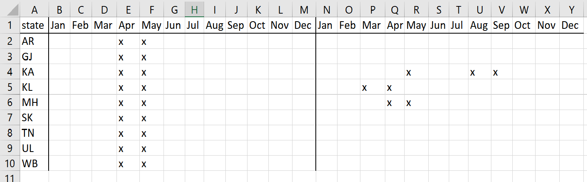

```{r setup, include=FALSE}
options(htmltools.dir.version = FALSE)
knitr::opts_chunk$set(
  fig.retina=3,
  out.width = "100%",
  cache = FALSE,
  echo = TRUE,
  message = FALSE, 
  warning = FALSE,
  hiline = TRUE
)
  
library(tidyverse)
library(lubridate)
library(patchwork)
library(xaringanBuilder)

# knitr::clean_cache(clean = TRUE)


# plot defaults
theme_set(theme_bw(base_size = 12, base_family = 'Fira Sans'))

```

```{r data_load, cache=TRUE, dependson="setup", echo=FALSE}
load("data/data_sub.RData")
```

### Introduction


.pull-left[
{{content}}
]

.pull-right[
.right[
.img-caption[
  
Instagram [@birding.memes](https://www.instagram.com/birding.memes/)
]
]
]

--

- Lifestyle shift  

- COVID-19 and birding  
{{content}}

--

- Movement, travel
{{content}}

--

- **Impact on eBird data**   
{{content}}

--

- Broad predictions (birder behaviour)


---
### Questions

.center[
**Changes and gaps in pandemic eBird data?**
]

--

<br>

.center[
$$ BEFORE\ (BEF) = 2018\ --19 $$

$$ DURING\ (DUR) = 2020\ --21 $$
]

---
### Questions

.center[
**Changes and gaps in pandemic eBird data?**
]

- Overall birding activity  

--

- Group birding  

--

- Birding effort  

--

- Biases in birding activity  
    - Spatial spread  
    - Temporal spread  

--

.center[
Numerous metrics using the focal data point, **checklists**.
]


---
class: center middle inverse subsection
# The COVID-19 timeline


---
### The COVID-19 timeline

.left-column[
COVID--19 waves
]

--

.right-column[
```{r nationalwaves, echo=FALSE, fig.height=4}
nwaves <- read.csv("data/covid_19_india.csv")
nwaves <- nwaves %>% mutate(date = as.Date(date, "%d/%m/%Y")) %>% 
  group_by(date) %>% summarise(cases = sum(cases))
nwaves <- nwaves %>% mutate(tot_cases = cases, 
                            cases = cases - lag(cases, default = 0))

ggplot(nwaves, aes(date, cases)) + geom_line() +
  scale_y_continuous(labels = scales::label_comma()) +
    ggtitle("New COVID cases (as of Aug 2021)") +
  xlab("Date") + ylab("Cases") +
  theme(axis.text.y = element_text(angle = 90),
        axis.title.y = element_text(vjust = 3))

```
]


---
### The COVID-19 timeline


.left-column[
COVID--19 waves

Lockdowns
]

.right-column[
```{r, echo=FALSE, fig.height=6}

```

.center[**Timeline information scarce!**]
]

---
### The COVID-19 timeline


.right-column[

```{r vax, echo=FALSE, fig.height=4}
vax <- read.csv("data/covid_vaccine_statewise.csv", as.is=F)
vax <- mutate(vax, date = as.Date(date, "%d/%m/%Y"))
ggplot(filter(vax, state == "India"), aes(date, dose2)) + geom_line() +
  scale_y_continuous(labels = scales::label_comma()) +
  ggtitle("Second vaccine doses administered (as of Aug 2021)") +
  xlab("Date") + ylab("Doses") +
  theme(axis.text.y = element_text(angle = 90),
        axis.title.y = element_text(vjust = 3))
```
]

.left-column[
COVID--19 waves

Lockdowns

Vaccination phases
]


---
class: center middle inverse subsection
# Exploratory results


---
class: center middle inverse subsection
## Birding activity


---
### Total and shared lists

.pull-left[
```{r no_lists_1, cache=TRUE, dependson="setup", message=FALSE, echo=FALSE, fig.height=5}
temp1 <- data_sub %>% 
  group_by(SAMPLING.EVENT.IDENTIFIER) %>% 
  slice(1) %>% ungroup() %>% 
  group_by(YEAR, MONTH, STATE) %>% 
  summarise(NO.LISTS = n_distinct(SAMPLING.EVENT.IDENTIFIER), COVID = min(COVID)) %>%
  ungroup() 

temp2 <- data_sub %>% 
  group_by(SAMPLING.EVENT.IDENTIFIER) %>% 
  slice(1) %>% ungroup() %>% 
  filter(NUMBER.OBSERVERS > 1) %>% 
  group_by(YEAR, MONTH, STATE) %>% 
  summarise(NO.SLISTS = n_distinct(SAMPLING.EVENT.IDENTIFIER), COVID = min(COVID)) %>%
  ungroup() 

nl_sw <- left_join(temp1, temp2)
rm(list = c("temp1","temp2"))

temp1 <- data_sub %>% 
  group_by(SAMPLING.EVENT.IDENTIFIER) %>% 
  slice(1) %>% ungroup() %>% 
  group_by(YEAR, MONTH) %>% 
  summarise(NO.LISTS = n_distinct(SAMPLING.EVENT.IDENTIFIER), COVID = min(COVID)) %>%
  ungroup() 

temp2 <- data_sub %>% 
  group_by(SAMPLING.EVENT.IDENTIFIER) %>% 
  slice(1) %>% ungroup() %>% 
  filter(NUMBER.OBSERVERS > 1) %>% 
  group_by(YEAR, MONTH) %>% 
  summarise(NO.SLISTS = n_distinct(SAMPLING.EVENT.IDENTIFIER), COVID = min(COVID)) %>%
  ungroup() 

nl_nw <- left_join(temp1, temp2)
rm(list = c("temp1","temp2"))

nl_sw <- nl_sw %>% 
  mutate(NO.SLISTS = ifelse(is.na(NO.SLISTS), 0, NO.SLISTS)) %>% 
  mutate(PROP.SLISTS = round(NO.SLISTS/NO.LISTS,2))
nl_nw <- nl_nw %>% 
  mutate(NO.SLISTS = ifelse(is.na(NO.SLISTS), 0, NO.SLISTS)) %>% 
  mutate(PROP.SLISTS = round(NO.SLISTS/NO.LISTS,2))

ggplot(nl_nw, aes(COVID, NO.LISTS, group = COVID)) + 
  scale_y_log10() + 
  geom_point(stat = "summary", fun.data = mean_cl_boot, size = 4) + 
  geom_errorbar(stat = 'summary', fun.data = mean_cl_boot, size = 1.25, width = 0.1) +
  xlab("COVID") + ylab("Total lists") |
ggplot(nl_nw, aes(COVID, NO.SLISTS, group = COVID)) + 
  scale_y_log10() + 
  geom_point(stat = "summary", fun.data = mean_cl_boot, size = 4) + 
  geom_errorbar(stat = 'summary', fun.data = mean_cl_boot, size = 1.25, width = 0.1) +
  xlab("COVID") + ylab("Shared lists")

rm(list=setdiff(ls(envir = .GlobalEnv), c("data_sub")), pos = ".GlobalEnv")
```
]

--

.pull-right[
```{r no_lists_2, cache=TRUE, dependson="setup", message=FALSE, echo=FALSE, fig.height=5}

(ggplot(nl_nw, aes(MONTH, PROP.SLISTS, colour = COVID)) + 
  scale_x_continuous(breaks = 1:12) + geom_point(size = 2) +
  xlab("Month") + ylab("Shared list proportion"))
```
]

???

Growth at all levels (lists, new eBirders, media)  

Continuing temporal trend *or* impact of pandemic?

Group birding taken hit   


---
### Lists per observer

```{r no_lists_po_1, cache=TRUE, dependson="setup", message=FALSE, echo=FALSE, fig.height=5, fig.width=11}
temp1 <- data_sub %>% 
  group_by(SAMPLING.EVENT.IDENTIFIER) %>% 
  slice(1) %>% ungroup() %>% 
  group_by(YEAR, MONTH, STATE, OBSERVER.ID) %>% 
  summarise(NO.LISTS = n_distinct(SAMPLING.EVENT.IDENTIFIER), COVID = min(COVID)) %>%
  ungroup() 

temp2 <- data_sub %>% 
  group_by(SAMPLING.EVENT.IDENTIFIER) %>% 
  slice(1) %>% ungroup() %>% 
  filter(NUMBER.OBSERVERS > 1) %>% 
  group_by(YEAR, MONTH, STATE, OBSERVER.ID) %>% 
  summarise(NO.SLISTS = n_distinct(SAMPLING.EVENT.IDENTIFIER), COVID = min(COVID)) %>%
  ungroup() 

nl_po_sw <- left_join(temp1, temp2)
rm(list = c("temp1","temp2"))

temp1 <- data_sub %>% 
  group_by(SAMPLING.EVENT.IDENTIFIER) %>% 
  slice(1) %>% ungroup() %>% 
  group_by(YEAR, MONTH, OBSERVER.ID) %>% 
  summarise(NO.LISTS = n_distinct(SAMPLING.EVENT.IDENTIFIER), COVID = min(COVID)) %>%
  ungroup() 

temp2 <- data_sub %>% 
  group_by(SAMPLING.EVENT.IDENTIFIER) %>% 
  slice(1) %>% ungroup() %>% 
  filter(NUMBER.OBSERVERS > 1) %>% 
  group_by(YEAR, MONTH, OBSERVER.ID) %>% 
  summarise(NO.SLISTS = n_distinct(SAMPLING.EVENT.IDENTIFIER), COVID = min(COVID)) %>%
  ungroup() 

nl_po_nw <- left_join(temp1, temp2)
rm(list = c("temp1","temp2"))

nl_po_sw <- nl_po_sw %>% 
  mutate(NO.SLISTS = ifelse(is.na(NO.SLISTS), 0, NO.SLISTS)) %>% 
  mutate(PROP.SLISTS = round(NO.SLISTS/NO.LISTS,2))

nl_po_nw <- nl_po_nw %>% 
  mutate(NO.SLISTS = ifelse(is.na(NO.SLISTS), 0, NO.SLISTS)) %>% 
  mutate(PROP.SLISTS = round(NO.SLISTS/NO.LISTS,2))


ggplot(nl_po_nw, aes(MONTH, PROP.SLISTS, colour = COVID)) + 
  scale_x_continuous(breaks = 1:12) + geom_smooth() +
  ggtitle("National level") +
  xlab("Month") + ylab("Shared list proportion per observer")

```


---
### Lists per observer

.pull-left[
```{r no_lists_po_2, cache=TRUE, dependson="setup", message=FALSE, echo=FALSE, fig.height=6}

((ggplot(filter(nl_po_sw, STATE == "Kerala"), aes(MONTH, PROP.SLISTS, colour = COVID)) +
  scale_x_continuous(breaks = 1:12) + geom_smooth()) +
  ggtitle("Kerala") +
  xlab("Month") + ylab("Shared list proportion per observer")) /
((ggplot(filter(nl_po_sw, STATE == "Karnataka"), aes(MONTH, PROP.SLISTS, colour = COVID)) +
  scale_x_continuous(breaks = 1:12) + geom_smooth()) +
   ggtitle("Karnataka") +
  xlab("Month") + ylab("Shared list proportion per observer")) 

```
]

???

- Kerala mirrored national patterns. Drastic during April--May.  

- Karnataka also affected during April--May, but otherwise very similar!   

- Gujarat also affected during April--May, but group birding rose sharply in winter.  


--

.pull-right[
```{r no_lists_po_3, cache=TRUE, dependson="setup", message=FALSE, echo=FALSE, fig.height=6}

((ggplot(filter(nl_po_sw, STATE == "Gujarat"), aes(MONTH, PROP.SLISTS, colour = COVID)) +
  scale_x_continuous(breaks = 1:12) + geom_smooth()) +
  ggtitle("Gujarat") +
  xlab("Month") + ylab("Shared list proportion per observer")) /
((ggplot(filter(nl_po_sw, STATE == "Arunachal Pradesh"), 
         aes(MONTH, PROP.SLISTS, colour = COVID)) +
  scale_x_continuous(breaks = 1:12) + geom_smooth()) +
   ggtitle("Arunachal Pradesh") +
  xlab("Month") + ylab("Shared list proportion per observer"))

# # To see what's going on with Gujarat's straight line
# nl_po_sw_bx <- nl_po_sw %>% 
#   group_by(COVID, MONTH, STATE) %>%
#   summarise(y0 = quantile(PROP.SLISTS, 0.05),
#             y25 = quantile(PROP.SLISTS, 0.25),
#             y50 = mean(PROP.SLISTS),
#             y75 = quantile(PROP.SLISTS, 0.75),
#             y100 = quantile(PROP.SLISTS, 0.95))
# 
# ggplot(filter(nl_po_sw_bx, STATE == "Gujarat"), 
#          aes(as.factor(MONTH), fill = COVID)) +
#   geom_boxplot(aes(ymin = y0, lower = y25, middle = y50, upper = y75, ymax = y100),
#                stat = "identity") +
#   scale_y_continuous(limits = c(0,1)) +
#   ggtitle("Gujarat")
# 
# rm(nl_po_sw_bx)

rm(list = c("nl_po_sw","nl_po_nw"))

```
]


---
class: center middle inverse subsection
## Birding effort


---

--

### Birding protocol

--

.center[
```{r protocol_1, cache=TRUE, dependson="setup", message=FALSE, echo=FALSE, fig.height=5, fig.width=11}

prot_nw <- data_sub %>% 
  group_by(SAMPLING.EVENT.IDENTIFIER) %>% 
  slice(1) %>% ungroup() %>% 
  group_by(YEAR, MONTH, PROTOCOL.TYPE) %>% 
  summarise(NO.LISTS = n_distinct(SAMPLING.EVENT.IDENTIFIER), COVID = min(COVID)) %>%
  ungroup() %>% group_by(COVID, YEAR, MONTH) %>% 
  pivot_wider(names_from = PROTOCOL.TYPE, values_from = NO.LISTS) %>% 
  mutate(PROP.S = round(Stationary/(Stationary+Traveling),2), 
         PROP.T = round(Traveling/(Stationary+Traveling),2))

prot_sw <- data_sub %>% 
  group_by(SAMPLING.EVENT.IDENTIFIER) %>% 
  slice(1) %>% ungroup() %>% 
  group_by(YEAR, MONTH, STATE, PROTOCOL.TYPE) %>% 
  summarise(NO.LISTS = n_distinct(SAMPLING.EVENT.IDENTIFIER), COVID = min(COVID)) %>%
  ungroup() %>% group_by(COVID) %>% 
  complete(YEAR, MONTH, STATE, PROTOCOL.TYPE, fill = list(NO.LISTS = 0)) %>% 
  ungroup() %>% group_by(COVID, YEAR, MONTH, STATE) %>% 
  pivot_wider(names_from = PROTOCOL.TYPE, values_from = NO.LISTS) %>% 
  mutate(PROP.S = round(Stationary/(Stationary+Traveling),2), 
         PROP.T = round(Traveling/(Stationary+Traveling),2))

# Daman and Diu lists not appearing from 2020--2021


(ggplot(prot_nw, aes(MONTH, PROP.S, colour = COVID)) + 
  scale_x_continuous(breaks = 1:12) + geom_point(size = 2) +
  ggtitle("National level") +
  xlab("Month") + ylab("Stationary list proportion")) 
```
]


---
### Birding protocol

.pull-left[
```{r protocol_2, cache=TRUE, dependson="setup", message=FALSE, echo=FALSE, fig.height=6}

(ggplot(filter(prot_sw, STATE == "Kerala"), aes(MONTH, PROP.S, colour = COVID)) + 
  scale_x_continuous(breaks = 1:12) + geom_point(size = 2) +
  ggtitle("Kerala") +
  xlab("Month") + ylab("Stationary list proportion")) /
(ggplot(filter(prot_sw, STATE == "Karnataka"), aes(MONTH, PROP.S, colour = COVID)) + 
  scale_x_continuous(breaks = 1:12) + geom_point(size = 2) +
  ggtitle("Karnataka") +
  xlab("Month") + ylab("Stationary list proportion"))
```
]

--

.pull-right[
```{r protocol_3, cache=TRUE, dependson="setup", message=FALSE, echo=FALSE, fig.height=6}

(ggplot(filter(prot_sw, STATE == "Gujarat"), aes(MONTH, PROP.S, colour = COVID)) + 
  scale_x_continuous(breaks = 1:12) + geom_point(size = 2) +
  ggtitle("Gujarat") +
  xlab("Month") + ylab("Stationary list proportion")) /
(ggplot(filter(prot_sw, STATE == "Arunachal Pradesh"), aes(MONTH, PROP.S, colour = COVID)) + 
  scale_x_continuous(breaks = 1:12) + geom_point(size = 2) +
  ggtitle("Arunachal Pradesh") +
  xlab("Month") + ylab("Stationary list proportion"))

rm(list = c("prot_nw","prot_sw"))

```
]


---
### Average distance travelled

--

.pull-left[
```{r distance_1, cache=TRUE, dependson="setup", message=FALSE, echo=FALSE, fig.height=5, fig.width=9}

dist <- data_sub %>% 
  group_by(SAMPLING.EVENT.IDENTIFIER) %>% 
  slice(1) %>% ungroup() %>% 
  filter(PROTOCOL.TYPE == "Traveling",
         !is.na(EFFORT.DISTANCE.KM))

(ggplot(dist, aes(MONTH, EFFORT.DISTANCE.KM, colour = COVID)) + 
  scale_y_log10() + scale_x_continuous(breaks = 1:12) + geom_smooth() +
  ggtitle("National level") +
  xlab("Month") + ylab("Distance travelled (km)"))

```
]

???
- Distance covered (among travelling lists) decreased greatly during April--May   

- Kerala different from others

--

.pull-right[
```{r distance_2, cache=TRUE, dependson="setup", message=FALSE, echo=FALSE, fig.height=5, fig.width=9}
(ggplot(filter(dist, STATE == "Kerala"), 
       aes(MONTH, EFFORT.DISTANCE.KM, colour = COVID)) + 
  scale_y_log10() + scale_x_continuous(breaks = 1:12) + geom_smooth() +
  ggtitle("Kerala") +
  xlab("Month") + ylab("Distance travelled (km)"))
```
]


---
### Average distance travelled

.pull-left[
```{r distance_3, cache=TRUE, dependson="setup", message=FALSE, echo=FALSE, fig.height=5, fig.width=9}
(ggplot(filter(dist, STATE == "Karnataka"), 
       aes(MONTH, EFFORT.DISTANCE.KM, colour = COVID)) + 
  scale_y_log10() + scale_x_continuous(breaks = 1:12) + geom_smooth() +
  ggtitle("Karnataka") +
  xlab("Month") + ylab("Distance travelled (km)"))
```
]

.pull-right[
```{r distance_4, cache=TRUE, dependson="setup", message=FALSE, echo=FALSE, fig.height=5, fig.width=9}
(ggplot(filter(dist, STATE == "Gujarat"), 
       aes(MONTH, EFFORT.DISTANCE.KM, colour = COVID)) + 
  scale_y_log10() + scale_x_continuous(breaks = 1:12) + geom_smooth() +
  ggtitle("Gujarat") +
  xlab("Month") + ylab("Distance travelled (km)"))

rm(dist)
```
]


---
### Site fidelity (per observer)

--

.center[
 $$ Site\ fidelity \quad \propto \quad \frac{1}{Unique^*\ locations\ visited}  $$ 

<br>

*A $\approx 1 km \times 1 km$ area defined by degree coordinates.
]


---
### Site fidelity (per observer)

.center[
 $$ Site\ fidelity \quad \propto \quad \frac{1}{Unique^*\ locations\ visited}  $$ 
]

.pull-left[
```{r fidelity_1, cache=TRUE, dependson="setup", message=FALSE, echo=FALSE, fig.height=5, fig.width=9}

fidel_nw <- data_sub %>% 
  group_by(SAMPLING.EVENT.IDENTIFIER) %>% 
  slice(1) %>% ungroup() %>% 
  mutate(COORD = paste0(round(LATITUDE, 2), ",", round(LONGITUDE, 2))) %>% #1kmx1km
  group_by(COVID, YEAR, MONTH, OBSERVER.ID) %>% 
  summarise(NO.SITES = n_distinct(COORD))

fidel_sw <- data_sub %>% 
  group_by(SAMPLING.EVENT.IDENTIFIER) %>% 
  slice(1) %>% ungroup() %>% 
  mutate(COORD = paste0(round(LATITUDE, 2), ",", round(LONGITUDE, 2))) %>% #1kmx1km
  group_by(COVID, YEAR, MONTH, STATE, OBSERVER.ID) %>% 
  summarise(NO.SITES = n_distinct(COORD))

(ggplot(fidel_nw, aes(MONTH, NO.SITES, colour = COVID)) + 
    scale_y_log10(breaks = seq(1, 4, 0.25)) + 
    scale_x_continuous(breaks = 1:12) + 
    geom_smooth() +
    ggtitle("National level") +
    xlab("Month") + ylab("Unique locations visited"))

```
]

???

- Similarly, site fidelity increased (no. of sites decreased) mostly during April--May   

- Different states with contradicting patterns  

- Kerala again different: tighter restrictions or more reluctant birders 

--

.pull-right[
```{r fidelity_2, cache=TRUE, dependson="setup", message=FALSE, echo=FALSE, fig.height=5, fig.width=9}

(ggplot(filter(fidel_sw, STATE == "Kerala"), 
        aes(MONTH, NO.SITES, colour = COVID)) + 
    scale_y_log10(breaks = seq(1, 4, 0.25)) + 
    scale_x_continuous(breaks = 1:12) + 
    geom_smooth() +
  ggtitle("Kerala") +
    xlab("Month") + ylab("Unique locations visited"))
```
]

---
### Site fidelity (per observer)

.center[
 $$ Site\ fidelity \quad \propto \quad \frac{1}{Unique^*\ locations\ visited}  $$ 
]

.pull-left[
```{r fidelity_3, cache=TRUE, dependson="setup", message=FALSE, echo=FALSE, fig.height=5, fig.width=9}

(ggplot(filter(fidel_sw, STATE == "Karnataka"), 
        aes(MONTH, NO.SITES, colour = COVID)) + 
    scale_y_log10(breaks = seq(1, 4, 0.25)) + 
    scale_x_continuous(breaks = 1:12) + 
    geom_smooth() +
   ggtitle("Karnataka") +
   xlab("Month") + ylab("Unique locations visited")) 
```
]

.pull-right[
```{r fidelity_4, cache=TRUE, dependson="setup", message=FALSE, echo=FALSE, fig.height=5, fig.width=9}
(ggplot(filter(fidel_sw, STATE == "Gujarat"), 
        aes(MONTH, NO.SITES, colour = COVID)) + 
    scale_y_log10(breaks = seq(1, 4, 0.25)) + 
    scale_x_continuous(breaks = 1:12) + 
    geom_smooth() +
   ggtitle("Gujarat") +
   xlab("Month") + ylab("Unique locations visited")) /

rm(list = c("fidel_nw","fidel_sw"))
```
]


---
### Total birding time

--

.center[
```{r time, cache=TRUE, dependson="setup", message=FALSE, echo=FALSE, fig.height=5, fig.width=11}

time_nw <- data_sub %>% 
  group_by(SAMPLING.EVENT.IDENTIFIER) %>% 
  slice(1) %>% ungroup() %>% 
  group_by(COVID, YEAR, MONTH, OBSERVER.ID) %>% 
  summarise(B.TIME = sum(DURATION.MINUTES))

time_nw_bx <- time_nw %>% 
  group_by(COVID, MONTH) %>%
  summarise(y0 = quantile(B.TIME, 0.05),
            y25 = quantile(B.TIME, 0.25),
            y50 = mean(B.TIME),
            y75 = quantile(B.TIME, 0.75),
            y100 = quantile(B.TIME, 0.95))

time_sw <- data_sub %>% 
  group_by(SAMPLING.EVENT.IDENTIFIER) %>% 
  slice(1) %>% ungroup() %>% 
  group_by(COVID, YEAR, MONTH, STATE, OBSERVER.ID) %>% 
  summarise(B.TIME = sum(DURATION.MINUTES))

time_sw_bx <- time_sw %>% 
  group_by(COVID, MONTH, STATE) %>%
  summarise(y0 = quantile(B.TIME, 0.05),
            y25 = quantile(B.TIME, 0.25),
            y50 = mean(B.TIME),
            y75 = quantile(B.TIME, 0.75),
            y100 = quantile(B.TIME, 0.95))


(ggplot(time_nw, aes(MONTH, B.TIME, colour = COVID)) + 
    scale_x_continuous(breaks = 1:12) + 
    geom_smooth() +
    ggtitle("National level") +
   xlab("Month") + ylab("Total birding time (mins)"))
```
]


???

April--May 
List duration, list length, no. of media lists all similar 


---
class: center middle inverse subsection
## Temporal bias


---
### Days of week (national level)

```{r t_spread_1, cache=TRUE, dependson="setup", message=FALSE, echo=FALSE, fig.height=5, fig.width=11}

temp1 <- data_sub %>% 
  group_by(SAMPLING.EVENT.IDENTIFIER) %>% 
  slice(1) %>% ungroup() %>% 
  mutate(DAYW = wday(OBSERVATION.DATE, 
                     week_start = getOption("lubridate.week.start", 1)),
         TIMED = hour(as_datetime(paste(OBSERVATION.DATE,
                                              TIME.OBSERVATIONS.STARTED)))) 

t_dow_nw <- temp1 %>% group_by(COVID, YEAR, MONTH, DAYW) %>% 
  summarise(NO.LISTS = n_distinct(SAMPLING.EVENT.IDENTIFIER), COVID = min(COVID)) %>%
  ungroup() %>% group_by(COVID, YEAR, MONTH) %>% 
  summarise(DAYW = DAYW, NO.LISTS = NO.LISTS, M.LISTS = sum(NO.LISTS)) %>% 
  mutate(PROP.LISTS = round(NO.LISTS/M.LISTS,2))

t_dow_sw <- temp1 %>% group_by(COVID, YEAR, MONTH, DAYW, STATE) %>% 
  summarise(NO.LISTS = n_distinct(SAMPLING.EVENT.IDENTIFIER), COVID = min(COVID)) %>%  
  ungroup() %>% group_by(COVID) %>% 
  complete(YEAR, MONTH, STATE, DAYW, fill = list(NO.LISTS = 0)) %>%
  ungroup() %>% group_by(COVID, YEAR, MONTH, STATE) %>% 
  summarise(DAYW = DAYW, NO.LISTS = NO.LISTS, M.LISTS = sum(NO.LISTS)) %>% 
  mutate(PROP.LISTS = round(NO.LISTS/M.LISTS,2))

t_tod_nw <- temp1 %>% group_by(COVID, YEAR, MONTH, TIMED) %>% 
  summarise(NO.LISTS = n_distinct(SAMPLING.EVENT.IDENTIFIER), COVID = min(COVID)) %>% 
  ungroup() %>% group_by(COVID) %>% 
  complete(YEAR, MONTH, TIMED, fill = list(NO.LISTS = 0)) %>%
  ungroup() %>% group_by(COVID, YEAR, MONTH) %>% 
  summarise(TIMED = TIMED, NO.LISTS = NO.LISTS, M.LISTS = sum(NO.LISTS)) %>% 
  mutate(PROP.LISTS = round(NO.LISTS/M.LISTS,2))
  
t_tod_sw <- temp1 %>% group_by(COVID, YEAR, MONTH, TIMED, STATE) %>% 
  summarise(NO.LISTS = n_distinct(SAMPLING.EVENT.IDENTIFIER), COVID = min(COVID)) %>%  
  ungroup() %>% group_by(COVID) %>% 
  complete(YEAR, MONTH, STATE, TIMED, fill = list(NO.LISTS = 0)) %>%
  ungroup() %>% group_by(COVID, YEAR, MONTH, STATE) %>% 
  summarise(TIMED = TIMED, NO.LISTS = NO.LISTS, M.LISTS = sum(NO.LISTS)) %>% 
  mutate(PROP.LISTS = round(NO.LISTS/M.LISTS,2))

# Daman and Diu issue


(ggplot(t_dow_nw, aes(as.factor(DAYW), PROP.LISTS, colour = COVID)) + 
   geom_point(stat = "summary", fun.data = mean_cl_boot, 
              size = 4, position = position_dodge(0.5)) +
   geom_errorbar(stat = 'summary', fun.data = mean_cl_boot, 
                 size = 1.25, width = 0.3, position = position_dodge(0.5)) +
   xlab("Day") + ylab("Proportion of lists"))

```


---
### Times of day (national level)

```{r t_spread_2, cache=TRUE, dependson="setup", message=FALSE, echo=FALSE, fig.height=5, fig.width=11}


  (ggplot(t_tod_nw, aes(as.factor(TIMED), PROP.LISTS, colour = COVID)) + 
   geom_point(stat = "summary", fun.data = mean_cl_boot, 
              size = 2, position = position_dodge(0.5)) +
     geom_errorbar(stat = 'summary', fun.data = mean_cl_boot, 
                 size = 1, width = 0.3, position = position_dodge(0.5)) +
     xlab("Hour") + ylab("Proportion of lists"))

```


---
class: center middle inverse subsection
# Summary


---
class: middle


.center[
Big national events had higher impact
{{content}}
]

???
Take home predictions

--

*(Role of novelty vs regulations?)*
{{content}}

--

National-state level mirroring
{{content}}

--

State-wise variation
{{content}}

--

Other *general* patterns
{{content}}


---
class: center middle subsection


# Thanks!


```{r print, include=FALSE}
# # remotes::install_github('rstudio/chromote')
# # remotes::install_github("jhelvy/xaringanBuilder")
# # install.packages("pdftools")
# xaringanBuilder::build_pdf("01_presentation_BCI.Rmd", partial_slides = T)
```

