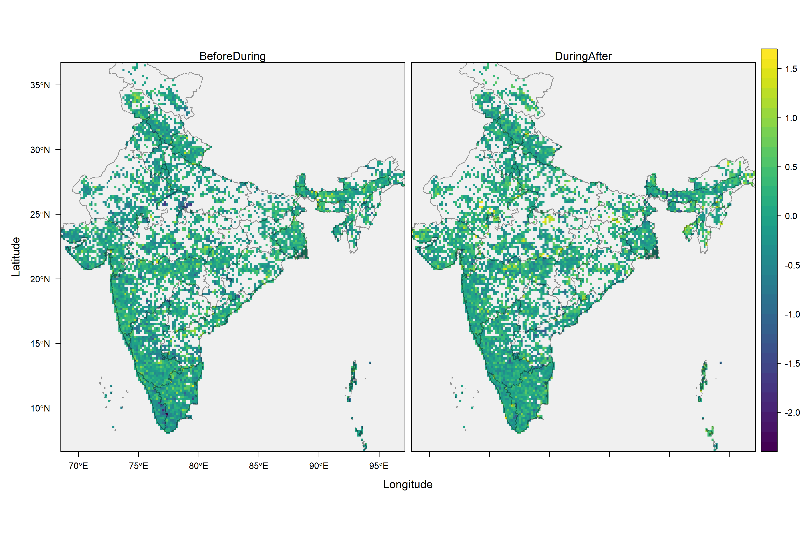

```{r setup, include=FALSE}

knitr::opts_chunk$set(results = 'asis', echo = FALSE, comment = FALSE, warning = FALSE,
                      message = FALSE, fig.align = 'center')

library(tidyverse)
library(lubridate)
library(patchwork)
library(kableExtra)

theme_set(theme_bw() +
            theme(panel.grid = element_blank(),
                  legend.position = "bottom",
                  text = element_text(size = 18)))

```

```{css logos-adj}

#main-img-left {
width: 25%;
bottom: 0.7in;
}
#main-img-center {
width: 25%;
bottom: 1.0in;
}
#main-img-right {
width: 25%;
bottom: 1.0in;
}
.main p {
margin-left: 0;
}

```

```{r prep, include=FALSE}

covid_palette <- c("#1B9E77", "#E89005", "#EF4050", "#9678B6")
# covid_palette2 <- c("#1B9E77", "#D95F02", "#7570B3", "#555555")
covid_palette3 <- c("#1B9E77", "#E89005", "#9678B6")

load("data/02_poster_BMS.RData")

source("scripts/functions.R")

```

# Introduction

Citizen science data in eBird [@sullivan2014] enables large-scale analyses and comparisons of bird abundance, helping guide conservation policy [@soib2020]. The reliability of such trends analyses is contingent on birdwatcher and bird behaviour remaining relatively unchanged between years. COVID-19 and the associated restrictions likely affected where, when and how birdwatchers observed birds during the pandemic years [e.g., @hochachka2021]. We explored whether this was true and if so how it has affected the data, so as to enable meaningful interpretation of any patterns in bird abundance seen during the pandemic years. 

# Methods

We compared data quantity and quality between three distinct periods: before (2019--2020), during (2020--21) and after (2021--22) the pandemic. We analysed data quantity based on number of lists and birding time per observer. Data quality was assessed using various metrics: observer site fidelity, birding distance, list length and duration, as well as proportions of group, hotspot and travelling birding instances. Additionally, we analysed temporal distribution of observations as well as spatial spread and coverage, including differences between urban and non-urban areas. 

# Results

- Birdwatchers across India did not reduce their birding effort with the pandemic (Figure \@ref(fig:figure1)A), nor did spatial coverage decrease (Figure \@ref(fig:figure1)B).  
- Birdwatching was highly **concentrated in urban areas** during the period of national lockdown and a few months following it in 2020 (Figure \@ref(fig:figure1)C).  

```{r figure1, fig.asp=0.7, fig.width=14, fig.cap="Intensity and coverage of bird observations did not decrease with the pandemic. Points represent mean values, and error bars show 95% confidence intervals.", cache=TRUE, echo=FALSE}

ggplot(urban_lists, aes(MONTH, PROP.U, colour = COVID)) + 
  scale_x_continuous(breaks = 1:12,
                     labels = c("Jan", "Feb", "Mar", "Apr", "May", "Jun", "Jul", "Aug", 
                                "Sep", "Oct", "Nov", "Dec")) + 
  geom_point(size = 3, position = position_dodge(0.5)) +
  geom_errorbar(aes(ymin = CI.L, ymax = CI.U), 
                size = 1.5, width = 0.7, position = position_dodge(0.5)) +
  scale_colour_manual(values = covid_palette,
                      name = "Period", 
                      labels = c("Before", "During (2020)", "During (2021)", "After")) +
  labs(title = "Urban birding",
       x = "Month", y = "Proportion of urban lists \n per grid cell") -> s_UNU_lists

ggplot(cover, aes(MONTH, PROP.CELLS, colour = COVID)) + 
  scale_x_continuous(breaks = 1:12,
                     labels = c("Jan", "Feb", "Mar", "Apr", "May", "Jun", "Jul", "Aug", 
                                "Sep", "Oct", "Nov", "Dec")) + 
  geom_point(size = 3, position = position_dodge(0.5)) +
  geom_errorbar(aes(ymin = CI.L, ymax = CI.U), 
                size = 1.5, width = 0.7, position = position_dodge(0.5)) +
  scale_colour_manual(values = covid_palette,
                      name = "Period", 
                      labels = c("Before", "During (2020)", "During (2021)", "After")) +
  labs(title = "Spatial coverage",
       x = "Month", y = "Proportion of grid cells \n with birding activity") -> s_cover

ggplot(net_effort, aes(x = PERIOD, y = PROP.CHANGE)) + 
  geom_point(size = 3, position = position_dodge(0.5)) +
  geom_errorbar(aes(ymin = CI.L, ymax = CI.U), 
                size = 1.5, width = 0.1, position = position_dodge(0.5)) +
  scale_y_continuous(limits = c(1.1, 2.3), breaks = seq(1, 3, 0.2)) +
  scale_x_discrete(labels = c("Before to During", "During to After")) +
  labs(title = "Net change in effort",
       x = "Period", y = "Proportional change in no. of lists \n per month per grid cell") -> s_spread_netchange


figure1 <- (s_spread_netchange | (s_cover / s_UNU_lists)) +
  plot_layout(widths = c(2, 3), guides = "collect") +
  plot_annotation(tag_levels = "A")


figure1

```

- The peak lockdown period was also associated with **changes in birder behaviour**: people avoided public/interactive birding and instead stuck to local areas (higher site fidelity; see Figure \@ref(fig:figure2)).

```{r figure2, fig.asp=1.8, fig.width=10, fig.cap="Site fidelity is defined as the number of unique 24kmx24km cells visited by an observer. Points represent mean values, and error bars show 95% confidence intervals.", cache=TRUE, echo=FALSE}

ggplot(nl_po_nw, aes(MONTH, PROP.SLISTS, colour = COVID)) + 
  scale_x_continuous(breaks = 1:12,
                     labels = c("Jan", "Feb", "Mar", "Apr", "May", "Jun", "Jul", "Aug", 
                                "Sep", "Oct", "Nov", "Dec")) + 
  geom_point(size = 3, position = position_dodge(0.5)) +
  geom_errorbar(aes(ymin = CI.L, ymax = CI.U), 
                size = 1.5, width = 0.7, position = position_dodge(0.5)) +
  scale_colour_manual(values = covid_palette,
                      name = "Period", 
                      labels = c("Before", "During (2020)", "During (2021)", "After")) +
  labs(title = "Group birding per observer",
       x = "Month", y = "Proportion of observer's \n lists that are group lists") -> no_lists_po

ggplot(hot_nw, aes(MONTH, PROP.HLISTS, colour = COVID)) + 
  scale_x_continuous(breaks = 1:12,
                     labels = c("Jan", "Feb", "Mar", "Apr", "May", "Jun", "Jul", "Aug", 
                                "Sep", "Oct", "Nov", "Dec")) + 
  geom_point(size = 3, position = position_dodge(0.5)) +
  geom_errorbar(aes(ymin = CI.L, ymax = CI.U), 
                size = 1.5, width = 0.7, position = position_dodge(0.5)) +
  scale_colour_manual(values = covid_palette,
                      name = "Period", 
                      labels = c("Before", "During (2020)", "During (2021)", "After")) +
  labs(title = "Hotspot birding",
       x = "Month", y = "Proportion of all lists \n that are from hotspots") -> hotspot

ggplot(prot_nw, aes(MONTH, PROP.TLISTS, colour = COVID)) + 
  scale_x_continuous(breaks = 1:12,
                     labels = c("Jan", "Feb", "Mar", "Apr", "May", "Jun", "Jul", "Aug", 
                                "Sep", "Oct", "Nov", "Dec")) + 
  geom_point(size = 3, position = position_dodge(0.5)) +
  geom_errorbar(aes(ymin = CI.L, ymax = CI.U), 
                size = 1.5, width = 0.7, position = position_dodge(0.5)) +
  scale_colour_manual(values = covid_palette,
                      name = "Period", 
                      labels = c("Before", "During (2020)", "During (2021)", "After")) +
  labs(title = "Travelling birding",
       x = "Month", y = "Proportion of all lists \n that use travelling protocol") -> protocol

ggplot(fidel_nw, aes(MONTH, NO.SITES, colour = COVID)) + 
  scale_y_log10() + 
  scale_x_continuous(breaks = 1:12,
                     labels = c("Jan", "Feb", "Mar", "Apr", "May", "Jun", "Jul", "Aug", 
                                "Sep", "Oct", "Nov", "Dec")) + 
  geom_point(size = 3, position = position_dodge(0.5)) +
  geom_errorbar(aes(ymin = CI.L, ymax = CI.U), 
                size = 1.5, width = 0.7, position = position_dodge(0.5)) +
  scale_colour_manual(values = covid_palette,
                      name = "Period", 
                      labels = c("Before", "During (2020)", "During (2021)", "After")) +
  labs(title = "Observer site fidelity",
       x = "Month", y = "No. of unique grid cells \n visited by an observer") -> fidelity

figure2 <- no_lists_po / hotspot / protocol / fidelity +
  plot_layout(guides = "collect") +
  plot_annotation(tag_levels = "A",
                  title = "What happened during lockdown?",
                  theme = theme(plot.title = element_text(size = 30)))

figure2

rm(list = c("nl_po_nw","no_lists_po","hot_nw","hotspot","prot_nw","protocol", "fidelity"))

```

- While site fidelity returned to pre-COVID levels immediately after the lockdown period, people **avoided birding in groups and in hotspots for the whole year**. In fact, group birding was avoided even in 2021 (Table \@ref(tab:table1)).  

```{r table1, out.width="100%"}

table1 <- data.frame(Metrics = 
                       c("Group birding", "Hotspot birding", "Travelling birding", 
                         "Birding distance", "List duration", "List length", 
                         "Observer site fidelity", "Observer birding time"),
                     Change = c("-ve", "-ve", "-ve", "-ve", "-ve" ,"-ve", "+ve", NA),
                     Period = c("Throughout", "2020", "2020", "Peaks", "Peaks", "Peaks",
                                "Peaks", NA))

table1 %>% 
  kable(caption = "List of data quality metrics and how they changed during the pandemic. The *Period* column indicates the duration for which the change persisted: throughout the two pandemic years, just 2020, or the crucial lockdown/peak months around March--May.",
        align = "lcc", booktabs = F)

```

- In some states, especially ones with metropolitan cities, birding on **weekdays and at late afternoon hours** increased during the pandemic (Figure \@ref(fig:figure3)).    
- Many **states showed different, often contradictory patterns**, reflecting differences in government response, severity of the disease, and perhaps general attitudes of the public.  

```{r figure3, fig.asp=0.9, fig.width=12, fig.cap="The pandemic in some states resulted in reduced weekend bias in birding activity, and a small spike during evening rush hours. Points represent mean values, and error bars show 95% confidence intervals.", cache=TRUE, echo=FALSE}

(((ggplot(filter(t_dow_sw, STATE == "Kerala"), 
          aes(DAY.W, PROP.LISTS, colour = COVID)) + 
     geom_point(size = 2, position = position_dodge(0.5)) +
     geom_errorbar(aes(ymin = CI.L, ymax = CI.U), 
                   size = 1, width = 0.7, position = position_dodge(0.5)) +
     scale_colour_manual(values = covid_palette,
                         name = "Period", 
                         labels = c("Before", "During (2020)", "During (2021)", "After")) +
     scale_x_continuous(breaks = 1:7,
                        labels = c("Mon", "Tue", "Wed", "Thu", "Fri", "Sat", "Sun")) +
     labs(title = "Kerala",
          x = "Day of week", y = "Proportion of lists \n in a week")) |
    (ggplot(filter(t_dow_sw, STATE == "Karnataka"), 
            aes(DAY.W, PROP.LISTS, colour = COVID)) + 
       geom_point(size = 2, position = position_dodge(0.5)) +
       geom_errorbar(aes(ymin = CI.L, ymax = CI.U), 
                     size = 1, width = 0.7, position = position_dodge(0.5)) +
       scale_colour_manual(values = covid_palette,
                           name = "Period", 
                           labels = c("Before", "During (2020)", "During (2021)", "After")) +
       scale_x_continuous(breaks = 1:7,
                          labels = c("Mon", "Tue", "Wed", "Thu", "Fri", "Sat", "Sun")) +
       labs(title = "Karnataka",
            x = "Day of week", y = ""))) /
   (ggplot(filter(t_tod_sw, STATE == "Gujarat"), 
            aes(as.factor(HOUR), PROP.LISTS, colour = COVID)) + 
       geom_point(size = 2, position = position_dodge(0.5)) +
       geom_errorbar(aes(ymin = CI.L, ymax = CI.U), 
                     size = 1, width = 0.8, position = position_dodge(0.5)) +
       scale_colour_manual(values = covid_palette,
                           name = "Period", 
                           labels = c("Before", "During (2020)", "During (2021)", "After")) +
       labs(title = "Gujarat",
            x = "Time of day (hours)", y = "Proportion of lists \n in a day")) /
      (ggplot(filter(t_tod_sw, STATE == "Maharashtra"), 
              aes(as.factor(HOUR), PROP.LISTS, colour = COVID)) + 
         geom_point(size = 2, position = position_dodge(0.5)) +
         geom_errorbar(aes(ymin = CI.L, ymax = CI.U), 
                       size = 1, width = 0.8, position = position_dodge(0.5)) +
         scale_colour_manual(values = covid_palette,
                             name = "Period", 
                             labels = c("Before", "During (2020)", "During (2021)", "After")) +
         labs(title = "Maharashtra",
              x = "Time of day (hours)", y = "Proportion of lists \n in a day"))) +
  plot_layout(guides = "collect") +
  plot_annotation(tag_levels = "A") -> figure3

figure3

```

```{r figure4, out.width="100%", fig.cap="Log proportional change in number of checklists across 24kmx24km grid cells in transition periods of the pandemic. Aside from a few small patches with decreased effort during the pandemic, there are no major spatial clusters of very high increase or decrease in birding effort.", cache=TRUE, echo=FALSE}



```

# Conclusions

- There was no negative impact on data quantity and its spatial and temporal coverage at the national level.  
- A few months, mostly around the periods of lockdown, witnessed changes in birder behaviour. These periods should be handled with diligence against artefactual abundance trends.
- Overall, eBird data from India can continue to be used in large-scale analyses of bird ecology, e.g., exploring whether or not bird detectability increased during the pandemic due to lower anthropogenic disturbance.  

# References

