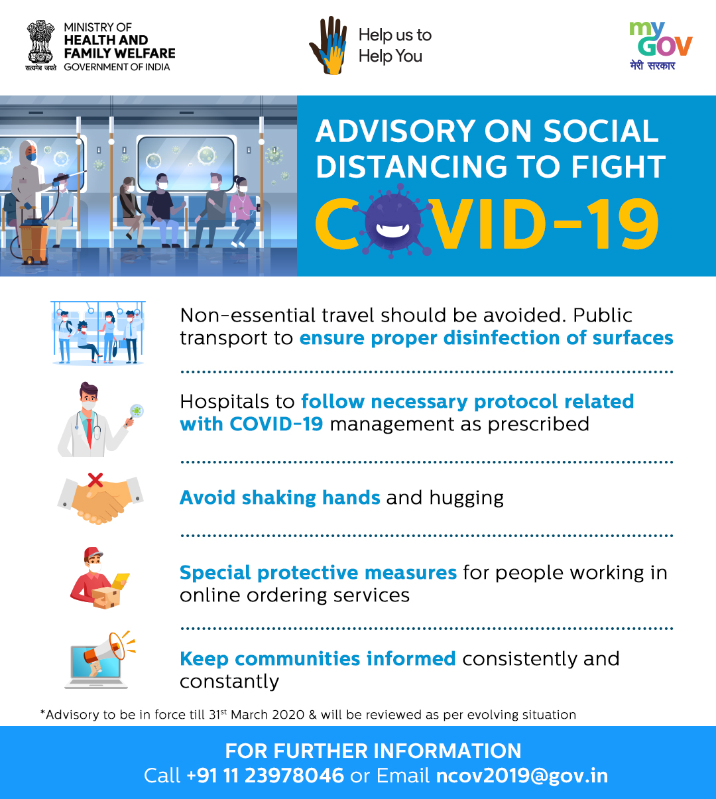
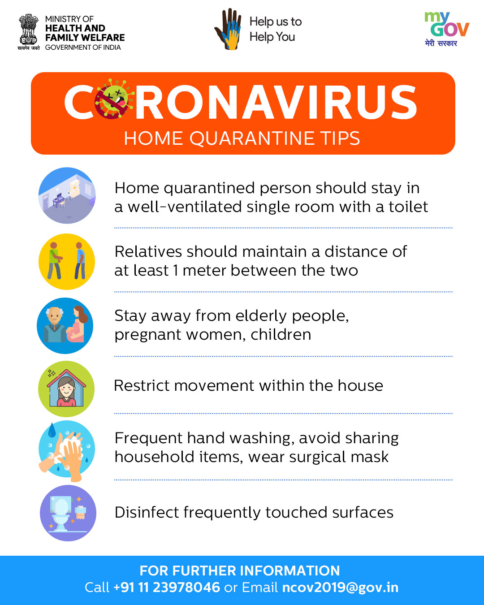
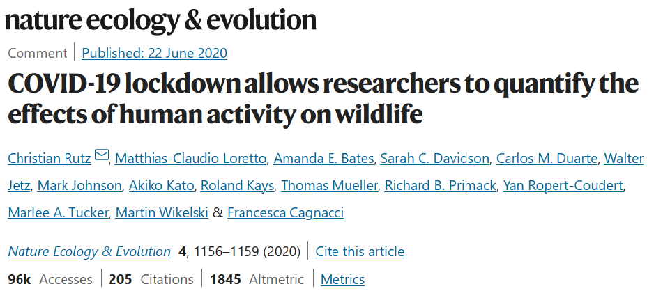
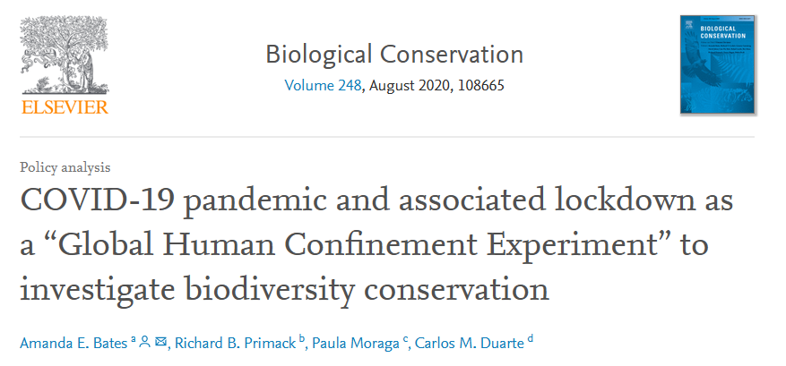
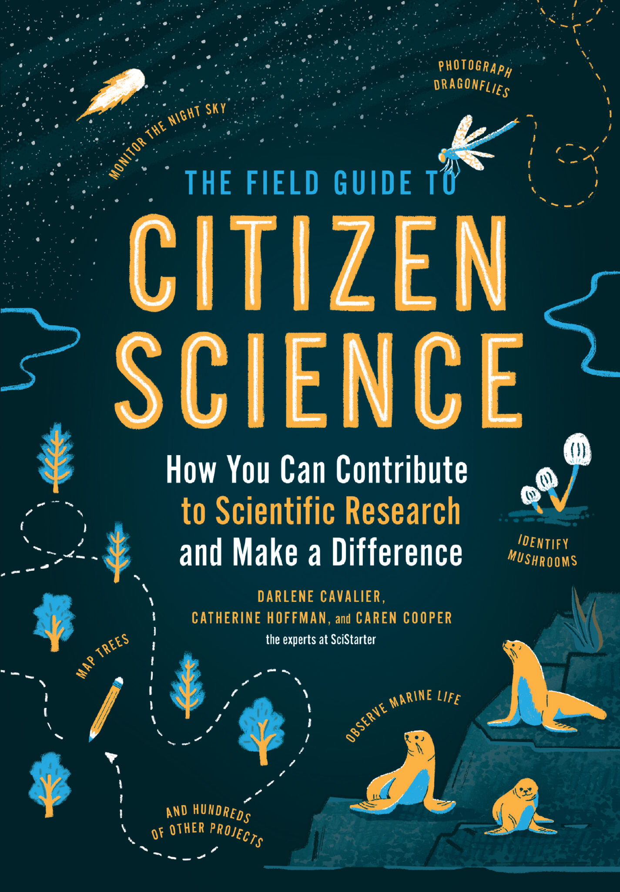
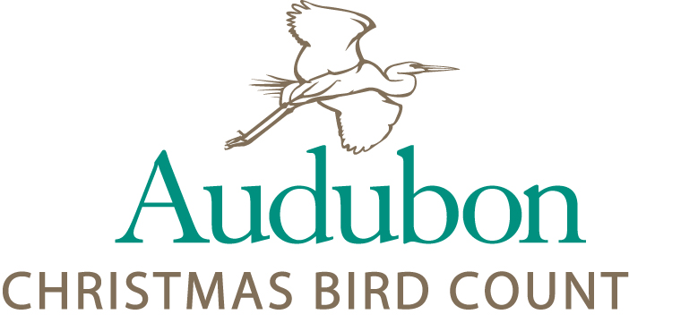
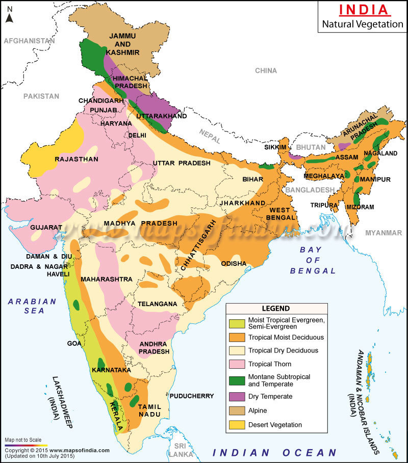
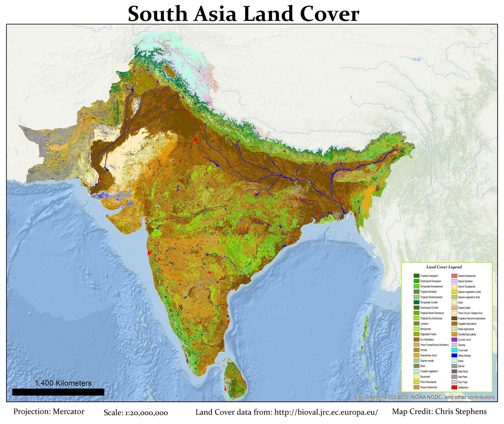
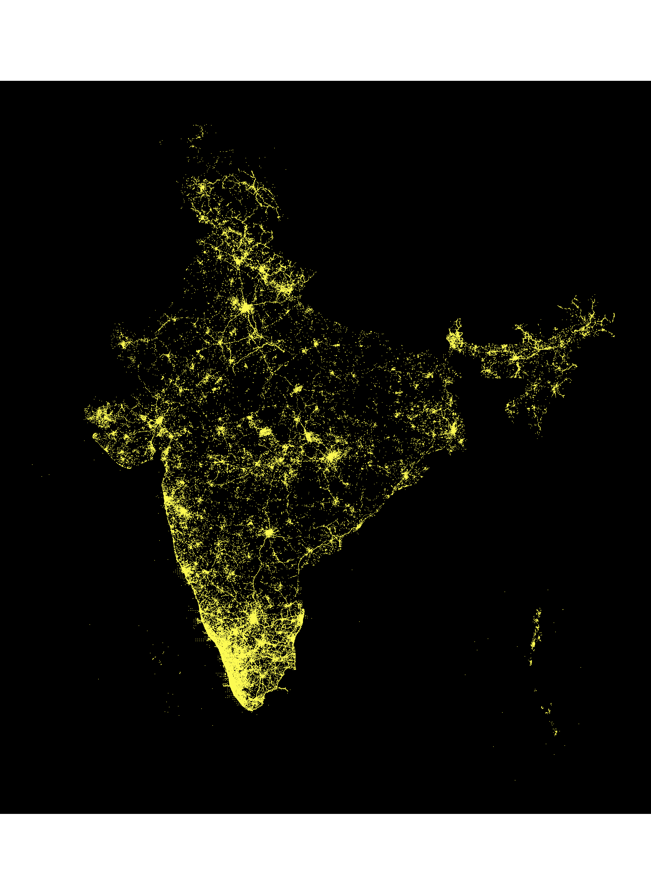
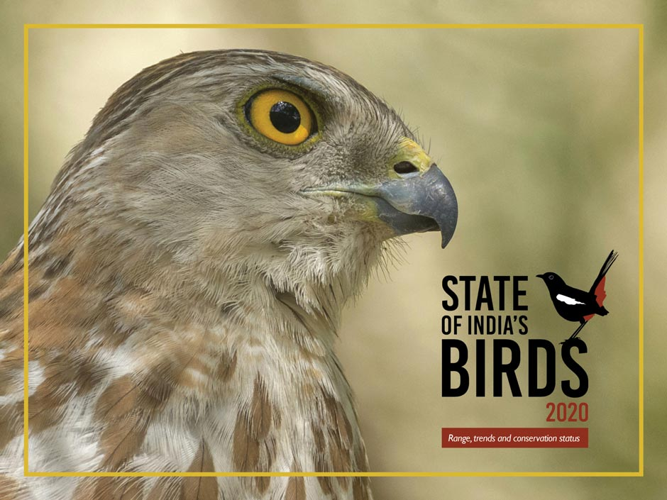

```{r setup, include=FALSE}
options(htmltools.dir.version = FALSE)
knitr::opts_chunk$set(
  fig.retina=3,
  out.width = "100%",
  cache = FALSE,
  echo = FALSE,
  inlcude = TRUE,
  message = FALSE, 
  warning = FALSE,
  hiline = TRUE
)
  
library(tidyverse)
library(lubridate)
library(patchwork)
library(xaringanBuilder)

# knitr::clean_cache(clean = TRUE)

# plot defaults
theme_set(theme_bw() +
            theme(panel.grid = element_blank(),
                  plot.tag.position = c(0.05, 0.98),
                  legend.position = "bottom",
                  text = element_text(size = 16),
                  legend.text = element_text(size = 12),
                  plot.margin = margin(0,0,0,0)))

theme_hide <- function () { 
    theme_classic() +
theme(panel.grid = element_blank(),
      axis.title = element_blank(),
      axis.text = element_blank(),
      axis.ticks = element_blank(),
      axis.line = element_blank(),
      plot.tag = element_blank(),
      plot.title = element_blank())
}

```

```{r prep, include=FALSE}

covid_palette <- c("#1B9E77", "#E89005", "#EF4050", "#9678B6")

load("data/03_presentation_IOC.RData")

source("scripts/functions.R")

```


class: inverse, center, middle, title-slide 

<div class="event-logo"></div>    

# The impact of the COVID-19 pandemic on birding and birds in India

## International Ornithological Congress <br> 14&ndash;20 August 2022

### Karthik Thrikkadeeri, Ashwin Viswanathan

<div class="instt-logo-bottomleft"></div>    

<div class="instt-logo-bottomright"></div>   

<div class="image-left"></div>    

<div class="image-right"></div>   

---
class: inverse, center, middle

# Introduction

---

class: inverse, center, middle
background-image: url("pics/global-covid.jpeg")
background-size: cover

---
class: middle

.pull-left[
  
]

.pull-right[
  
]

???
Physical but also psychological and social.
Loss of life, trade, industries, businesses, movement.
Humans lost interaction with other humans and nature.  
Everything went virtual/digital.
Changed how we consume information, learn, work, socialise, communicate.

---
class: center, middle

# .fancy[Anthropause]

### .fancy[/anθrəpɔːz/]

--

.fancy[a considerable global slowing of modern human activities, notably travel]

[.right[.fancy[Rutz et al., 2020]]](https://www.nature.com/articles/s41559-020-1237-z)

---
class: center, middle

[](https://www.nature.com/articles/s41559-020-1237-z)


---
class: center, middle

[](https://www.sciencedirect.com/science/article/pii/S0006320720307230)

???
Shortcomings of traditional methods of data collection for scientific research---especially contingent on human circumstances. 
However, many of these pitfalls do not apply as strongly to (and hence can be overcome by using) large-scale, crowdsourced, open access data on a wide variety of metrics, from human traffic levels to species occurrence [@bates2020].

---
class: middle

.pull-left[

]

???
Citizen science today is a research technique that engages volunteers from the general public---most of whom are not trained as scientists---in collecting and/or analysing and interpreting data as part of a scientific enquiry [@silvertown2009]. Most importantly, citizen science programmes facilitate attempts at answering large-scale questions that are otherwise not feasible [@macphail2020].

---
class: middle

.pull-left[

]

.pull-right[
.center[
[](https://www.audubon.org/conservation/join-christmas-bird-count)
[](https://www.zooniverse.org/)  

<br>

[](https://www.inaturalist.org/)  

[](https://ebird.org/)
]
]

---
class: middle

.pull-left[

]

.pull-right[

]

---
class: middle
background-color: black

.pull-right[

]

```{css echo=FALSE}
.yellow {
  color: #EECF69;
}

.grey {
  color: #D2D5DA;
}
```

.middle2[
.yellow[
3,62,747 locations  
19,54,724 lists  
18,03,095 hrs  
30,564 people  
<br>
36 States/UTs  
635 districts  
<br>
1,352 species  
33 million observations
]

<br>

.small[.grey[
*Data until March 2022*
]]

]


---
class: centre, middle
background-image: url("pics/amfa.gif")
background-size: contain

Maybe a slide showing what insights eBird data has enabled in India? Migration maps, ...

???
The quality and reliability of this data is highly contingent on the collectors, i.e., citizens.  
Birder behaviour needs to be uniform and consistent.  
Thus, our primary concern now is whether or not the usefulness of such data has changed with the pandemic.

---
class: centre, middle
background-image: url("pics/soib-cover.jpg")
background-size: contain

---
class: inverse, center, middle

# Questions

---
class: middle

### 1. Did eBirder behaviour change during the pandemic?  

<br>

--

If so, how has it changed in terms of data quantity and quality? 

--

What are the implications for usefulness of eBird data from the pandemic years? 

<br>

--

### 2. Was there a visible difference in patterns of bird detection?

???
Can this be attributed to changes in birder behaviour, or did birds truly modify their behaviour?

---
background-image: url("pics/ebird-explore.png")
background-size: contain

---
background-image: url("pics/ebird-explore-2.png")
background-size: contain

---
background-image: url("pics/sample-checklist.png")
background-size: contain

---
background-image: url("pics/sample-checklist-1.png")
background-size: contain

---
background-image: url("pics/sample-checklist-2.png")
background-size: contain

---
background-image: url("pics/sample-checklist-3.png")
background-size: contain

---
background-image: url("pics/sample-checklist-4.png")
background-size: contain

---
background-image: url("pics/sample-checklist-5.png")
background-size: contain

---
background-image: url("pics/sample-checklist-6.png")
background-size: contain

---
background-image: url("pics/sample-checklist-7.png")
background-size: contain

???
How bias in birder behaviour can affect rep.freq.  
Essentially, the kind of birds one likely to see changes depending on all the above factors.  

---
class: inverse, center, middle

# Methods

---
class: middle

```{r fig.dim=c(16,6), cache=TRUE, dependson="setup"}

library(tidyverse)
library(lubridate)

x <- read_csv("data/covid_classification.csv") %>% 
  filter(!is.na(COVID)) %>% 
  mutate(DATE = as.Date(paste(YEAR, MONTH, "01", sep = "-")),
         COVID = factor(COVID, levels = c("BEF", "DUR_20", "DUR_21", "AFT")))

y <- x %>% 
  summarise(YEAR.RANGE = as.Date(seq(min(DATE) + months(1), # buffers for placement on graph
                                     max(DATE) + months(1), 
                                     by = "year"),  
                                   origin = "1970-01-01"))

# for rect
z <- x %>% 
  group_by(COVID) %>% 
  summarise(DATE = DATE,
            START = min(DATE) - months(1),
            END = max(DATE))

covid_palette <- c("#1B9E77", "#E89005", "#EF4050", "#9678B6")

ggplot(x, aes(x = DATE)) +
  theme_classic() +
  theme(axis.title.x = element_blank(),
        axis.text.x = element_blank(),
        axis.ticks.x = element_blank(),
        axis.line.x = element_blank(),
        axis.title.y = element_blank(),
        axis.text.y = element_blank(),
        axis.ticks.y = element_blank(),
        axis.line.y = element_blank(),
        legend.position = "top",
        legend.title = element_text(size = 20),
        legend.text = element_text(size = 12),
        plot.title = element_text(size = 40)) +
  ylim(-0.15,0.125) +
  geom_hline(yintercept = 0,  color = "black", size = 1.5) +
  # COVID categories
  geom_rect(data = z, 
            aes(xmin = START, xmax = END, ymin = 0.025, ymax = 0.1, fill = COVID)) +
  geom_segment(data = z, 
               aes(x = START+days(1), xend = START+days(1), y = -0.025, yend = 0.025), 
               linetype = "dashed", size = 0.75) +
  # geom_ribbon(aes(y = 0.1, xmin = min(DATE), xmax = max(DATE), fill = COVID), size = 1) +
  scale_fill_manual(values = covid_palette, 
                    name = "Period",
                    labels = c("Before", "During (2020)", "During (2021)", "After")) +
  # month labels
  geom_text(aes(x = DATE, y = -0.04, label = month(DATE, label = T)), 
            size = 5, angle = 90) +
  # year labels
  geom_text(data = y, 
            aes(x = YEAR.RANGE, y = -0.08, label = year(YEAR.RANGE), fontface="bold"), 
            size = 7) +
  labs(title = "Timeline of study \n ", subtitle = " \n ")

```

---
class: inverse, center, middle

### 1. Did eBirder behaviour change during the pandemic?

---
class: middle

```{r fig.dim=c(16,9), cache=TRUE, dependson="setup"}

ggplot(net_effort, aes(x = PERIOD, y = PROP.CHANGE)) + 
  scale_y_continuous(limits = c(1.1, 2.3), breaks = seq(1, 3, 0.2)) +
  scale_x_discrete(labels = c("Before to During", "During to After")) +
  labs(title = "Birders continued to upload an increasing \nnumber of lists",
       x = "Period", y = "Proportional change in monthly no. of lists per grid cell") -> s_spread_netchange_hide

ggplot(cover, aes(MONTH, PROP.CELLS, colour = COVID)) + 
  scale_x_continuous(breaks = 1:12,
                     labels = c("Jan", "Feb", "Mar", "Apr", "May", "Jun", "Jul", "Aug", 
                                "Sep", "Oct", "Nov", "Dec")) + 
  scale_colour_manual(values = covid_palette,
                      name = "Period", 
                      labels = c("Before", "During (2020)", "During (2021)", "After")) +
  labs(title = "Birders collectively covered larger overall areas each year",
       x = "Month", y = "Proportion of grid cells \nwith birding activity") -> s_cover_hide

ggplot(urban_lists, aes(MONTH, PROP.U, colour = COVID)) + 
  scale_x_continuous(breaks = 1:12,
                     labels = c("Jan", "Feb", "Mar", "Apr", "May", "Jun", "Jul", "Aug", 
                                "Sep", "Oct", "Nov", "Dec")) + 
  scale_colour_manual(values = covid_palette,
                      name = "Period", 
                      labels = c("Before", "During (2020)", "During (2021)", "After")) +
  labs(title = "2020 lockdown restricted birders to urban areas",
       x = "Month", y = "Proportion of urban \nlists per grid cell") -> s_UNU_lists_hide


s_spread_netchange_hide + 
  geom_point(size = 4, position = position_dodge(0.5)) +
  geom_errorbar(aes(ymin = CI.L, ymax = CI.U), 
                size = 1.75, width = 0.08, position = position_dodge(0.5)) -> s_spread_netchange

s_cover_hide + 
  geom_point(size = 4, position = position_dodge(0.5)) +
  geom_errorbar(aes(ymin = CI.L, ymax = CI.U), 
                size = 1.75, width = 0.7, position = position_dodge(0.5)) -> s_cover

s_UNU_lists_hide + 
  annotate("rect", xmin = 2.5, xmax = 7.5, ymin = -Inf, ymax = Inf, 
            fill = "#E0DDE3", col = NA, alpha = 0.5) +
  geom_point(size = 4, position = position_dodge(0.5)) +
  geom_errorbar(aes(ymin = CI.L, ymax = CI.U), 
                size = 1.75, width = 0.7, position = position_dodge(0.5)) -> s_UNU_lists

((s_spread_netchange_hide + theme_hide()) | 
    ((s_cover_hide + theme_hide()) / 
       (s_UNU_lists_hide + theme_hide()))) +
  plot_layout(widths = c(2, 3), guides = "collect") +
  plot_annotation(tag_levels = "A",
                  title = "Birdwatching effort did not decrease in the pandemic years",
                  subtitle = "",
                  theme = theme(plot.title = element_text(size = 35)))

```

---
class: middle

```{r fig.dim=c(16,9)}

((s_spread_netchange_hide) | 
    ((s_cover_hide + theme_hide()) / 
       (s_UNU_lists_hide + theme_hide()))) +
  plot_layout(widths = c(2, 3), guides = "collect") +
  plot_annotation(tag_levels = "A",
                  title = "Birdwatching effort did not decrease in the pandemic years",
                  subtitle = "Size of grid cells is 24km \u00d7 24km",
                  theme = theme(plot.title = element_text(size = 35)))

```

---
class: middle

```{r fig.dim=c(16,9)}

((s_spread_netchange) | 
    ((s_cover_hide + theme_hide()) / 
       (s_UNU_lists_hide + theme_hide()))) +
  plot_layout(widths = c(2, 3), guides = "collect") +
  plot_annotation(tag_levels = "A",
                  title = "Birdwatching effort did not decrease in the pandemic years",
                  subtitle = "Size of grid cells is 24km \u00d7 24km",
                  theme = theme(plot.title = element_text(size = 35)))

```

---
class: middle

```{r fig.dim=c(16,9)}

((s_spread_netchange) | 
    ((s_cover) / 
       (s_UNU_lists_hide + theme_hide()))) +
  plot_layout(widths = c(2, 3), guides = "collect") +
  plot_annotation(tag_levels = "A",
                  title = "Birdwatching effort did not decrease in the pandemic years",
                  subtitle = "Size of grid cells is 24km \u00d7 24km",
                  theme = theme(plot.title = element_text(size = 35)))

```

---
class: middle

```{r fig.dim=c(16,9)}

((s_spread_netchange) | 
    ((s_cover) / 
       (s_UNU_lists))) +
  plot_layout(widths = c(2, 3), guides = "collect") +
  plot_annotation(tag_levels = "A",
                  title = "Birdwatching effort did not decrease in the pandemic years",
                  subtitle = "Size of grid cells is 24km \u00d7 24km",
                  theme = theme(plot.title = element_text(size = 35)))

```

---
background-image: url("pics/03_presentation_IOC_map.png")
background-size: contain

---
background-image: url("pics/03_presentation_IOC_map-2.png")
background-size: contain

---
background-image: url("pics/03_presentation_IOC_map.png")
background-size: contain

---
class: center, middle

## What happened during lockdown?

---
class: center, middle

```{r fig.dim=c(13,7), cache=TRUE, dependson="setup"}

ggplot(nl_po_nw, aes(MONTH, PROP.SLISTS, colour = COVID)) + 
  scale_x_continuous(breaks = 1:12,
                     labels = month(unique(nl_po_nw$MONTH), label = T)) + 
  scale_colour_manual(values = covid_palette,
                      name = "Period", 
                      labels = c("Before", "During (2020)", "During (2021)", "After")) +
  labs(title = "Birders avoided group interactions throughout the two pandemic years",
       x = "Month", y = "Proportion of observer's lists that are of group birding") -> no_lists_po_hide

no_lists_po_hide + 
  annotate("rect", xmin = 2.5, xmax = 11.5, ymin = -Inf, ymax = Inf, 
            fill = "#E0DDE3", col = NA, alpha = 0.5) +
  geom_point(size = 4, position = position_dodge(0.5)) +
  geom_errorbar(aes(ymin = CI.L, ymax = CI.U), 
                size = 1.75, width = 0.7, position = position_dodge(0.5)) -> no_lists_po


ggplot(hot_nw, aes(MONTH, PROP.HLISTS, colour = COVID)) + 
  scale_x_continuous(breaks = 1:12,
                     labels = month(unique(hot_nw$MONTH), label = T)) + 
  scale_colour_manual(values = covid_palette,
                      name = "Period", 
                      labels = c("Before", "During (2020)", "During (2021)", "After")) +
  labs(title = "Birders avoided hotspot visits during the first lockdown, but this gradually returned to normal",
       x = "Month", y = "Proportion of all lists that are from hotspots") -> hotspot_hide

hotspot_hide + 
  annotate("rect", xmin = 3.5, xmax = 10.5, ymin = -Inf, ymax = Inf, 
            fill = "#E0DDE3", col = NA, alpha = 0.5) +
  geom_point(size = 4, position = position_dodge(0.5)) +
  geom_errorbar(aes(ymin = CI.L, ymax = CI.U), 
                size = 1.75, width = 0.7, position = position_dodge(0.5)) -> hotspot


ggplot(prot_nw, aes(MONTH, PROP.TLISTS, colour = COVID)) + 
  scale_x_continuous(breaks = 1:12,
                     labels = month(unique(prot_nw$MONTH), label = T)) + 
  scale_colour_manual(values = covid_palette,
                      name = "Period", 
                      labels = c("Before", "During (2020)", "During (2021)", "After")) +
  labs(title = "Birders became more sedentary during the first lockdown, but this gradually returned to normal",
       x = "Month", y = "Proportion of all lists that use the \"Travelling\" protocol") -> protocol_hide

protocol_hide + 
  annotate("rect", xmin = 2.5, xmax = 8.5, ymin = -Inf, ymax = Inf, 
            fill = "#E0DDE3", col = NA, alpha = 0.5) +
  geom_point(size = 4, position = position_dodge(0.5)) +
  geom_errorbar(aes(ymin = CI.L, ymax = CI.U), 
                size = 1.75, width = 0.7, position = position_dodge(0.5)) -> protocol


ggplot(fidel_nw, aes(MONTH, NO.SITES, colour = COVID)) + 
  scale_y_log10() + 
  scale_x_continuous(breaks = 1:12,
                     labels = month(unique(fidel_nw$MONTH), label = T)) + 
  scale_colour_manual(values = covid_palette,
                      name = "Period", 
                      labels = c("Before", "During (2020)", "During (2021)", "After")) +
  labs(title = "Birders visited very few geographical locations during the first lockdown (higher site fidelity)",
       x = "Month", y = "No. of unique grid cells visited by an observer") -> fidelity_hide

fidelity_hide + 
  annotate("rect", xmin = 3.5, xmax = 6.5, ymin = 1, ymax = +Inf, 
            fill = "#E0DDE3", col = NA, alpha = 0.5) +
  geom_point(size = 4, position = position_dodge(0.5)) +
  geom_errorbar(aes(ymin = CI.L, ymax = CI.U), 
                size = 1.75, width = 0.7, position = position_dodge(0.5)) -> fidelity

no_lists_po

```

---
class: center, middle

```{r fig.dim=c(13,7)}

hotspot

```

---
class: center, middle

```{r fig.dim=c(13,7)}

protocol

```

---
class: center, middle

```{r fig.dim=c(13,7)}

fidelity

```

---
class: center, middle

### Implications of changes in birder behaviour?

--

.fancy[(... for large-scale analyses of bird abundance and distribution)]

---
class: inverse, center, middle

### 2. Was there a visible difference in patterns of bird detection?

--

<br>

*If so, is it an artefact of the changes in birder behaviour, or was there actually a behavioural shift in birds?*

---


---
class: inverse, center, middle

### What does this all mean?

---

Visible effect during "peak" periods  

--

- National lockdown in 2020  
- Second wave in 2021  

---

Visible effect during "peak" periods  

- National lockdown in 2020  
- Second wave in 2021  

Disappears at scale of interest  

--



---

Visible effect during "peak" periods  

- National lockdown in 2020  
- Second wave in 2021  

Disappears at scale of interest  

- Birders active again after "peak" periods  

--

Care to be taken when operating at the small scale

---
class: center, bottom

### eBird data still useful!

<br>


---

## Acknowledgements

---
class: inverse, center, middle

# Thank you! &#x1F604;